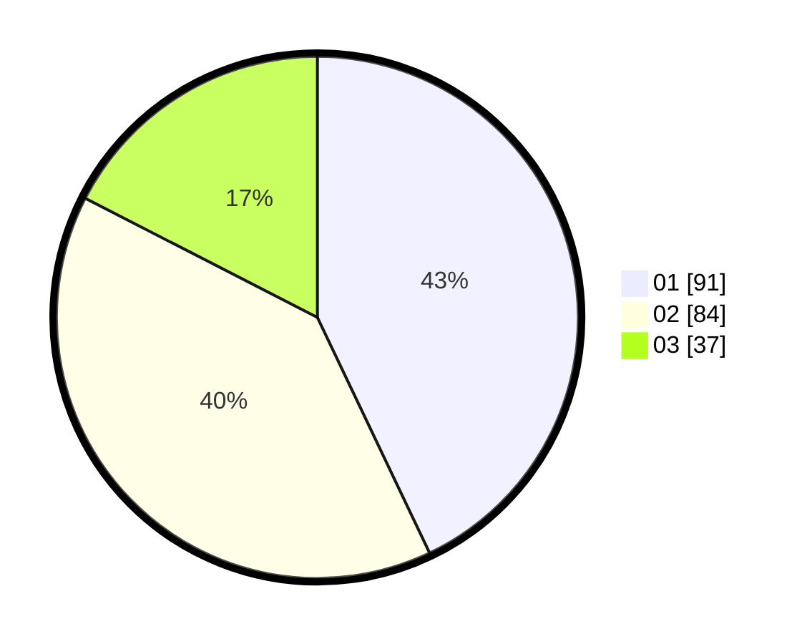

# Hasil

Hasil perolehan suara paslon dapat dilihat pada file paslon-01.txt, paslon-02.txt, dan paslon-03.txt.

Jika tidak ada, artinya data tersebut belum ada pada SIREKAP.

## Perolehan Suara

 * Paslon 01: **91**.
 * Paslon 02: **84**.
 * Paslon 03: **37**.

## Foto C Plano

https://sirekap-obj-formc.kpu.go.id/5596/pemilu/ppwp/31/71/07/10/04/3171071004084-20240216-165417--4e753066-c727-4f8c-b6be-d08e0d487f97.jpg

https://sirekap-obj-formc.kpu.go.id/5596/pemilu/ppwp/31/71/07/10/04/3171071004084-20240216-165418--3979439f-8f8f-486f-87e0-c60c703df57b.jpg

https://sirekap-obj-formc.kpu.go.id/5596/pemilu/ppwp/31/71/07/10/04/3171071004084-20240216-165417--69bc5f88-7d74-4220-8f9f-ad719d8f887d.jpg

## DATA PEMILIH TETAP

Jumlah pemilih dalam DPT: **273**.
 * L: **136**.
 * P: **137**.

## DATA PENGGUNA HAK PILIH

Jumlah pengguna hak pilih dalam DPT: **205**.
 * L: **103**.
 * P: **102**.

Jumlah pengguna hak pilih dalam DPTb: **5**.
 * L: **1**.
 * P: **4**.

Jumlah pengguna hak pilih dalam DPK: **5**.
 * L: **4**.
 * P: **1**.

Jumlah pengguna hak pilih: **215**.
 * L: **108**.
 * P: **107**.

## JUMLAH SUARA SAH DAN TIDAK SAH

JUMLAH SELURUH SUARA SAH: **212**.

JUMLAH SUARA TIDAK SAH: **3**.

JUMLAH SELURUH SUARA SAH DAN SUARA TIDAK SAH: **215**.
