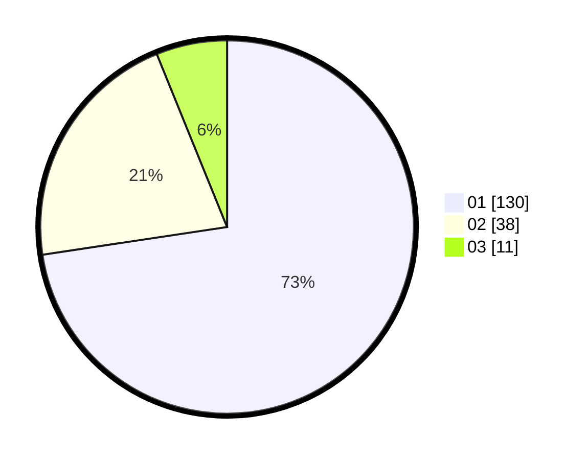

# Hasil

Hasil perolehan suara paslon dapat dilihat pada file paslon-01.txt, paslon-02.txt, dan paslon-03.txt.

Jika tidak ada, artinya data tersebut belum ada pada SIREKAP.

## Perolehan Suara

 * Paslon 01: **130**.
 * Paslon 02: **38**.
 * Paslon 03: **11**.

## Foto C Plano

https://sirekap-obj-formc.kpu.go.id/cf74/pemilu/ppwp/31/71/07/10/04/3171071004086-20240214-210710--046329d4-61fa-4e7e-973b-da7a52a42606.jpg

https://sirekap-obj-formc.kpu.go.id/cf74/pemilu/ppwp/31/71/07/10/04/3171071004086-20240214-200308--2d19217d-2357-45d1-ae8c-f2fc8dd1a27d.jpg

https://sirekap-obj-formc.kpu.go.id/cf74/pemilu/ppwp/31/71/07/10/04/3171071004086-20240214-211954--6971439f-3966-4801-8fd7-c09bc6f99368.jpg

## DATA PEMILIH TETAP

Jumlah pemilih dalam DPT: **240**.
 * L: **125**.
 * P: **115**.

## DATA PENGGUNA HAK PILIH

Jumlah pengguna hak pilih dalam DPT: **174**.
 * L: **86**.
 * P: **88**.

Jumlah pengguna hak pilih dalam DPTb: **0**.
 * L: **0**.
 * P: **0**.

Jumlah pengguna hak pilih dalam DPK: **5**.
 * L: **3**.
 * P: **2**.

Jumlah pengguna hak pilih: **179**.
 * L: **89**.
 * P: **90**.

## JUMLAH SUARA SAH DAN TIDAK SAH

JUMLAH SELURUH SUARA SAH: **179**.

JUMLAH SUARA TIDAK SAH: **0**.

JUMLAH SELURUH SUARA SAH DAN SUARA TIDAK SAH: **179**.
