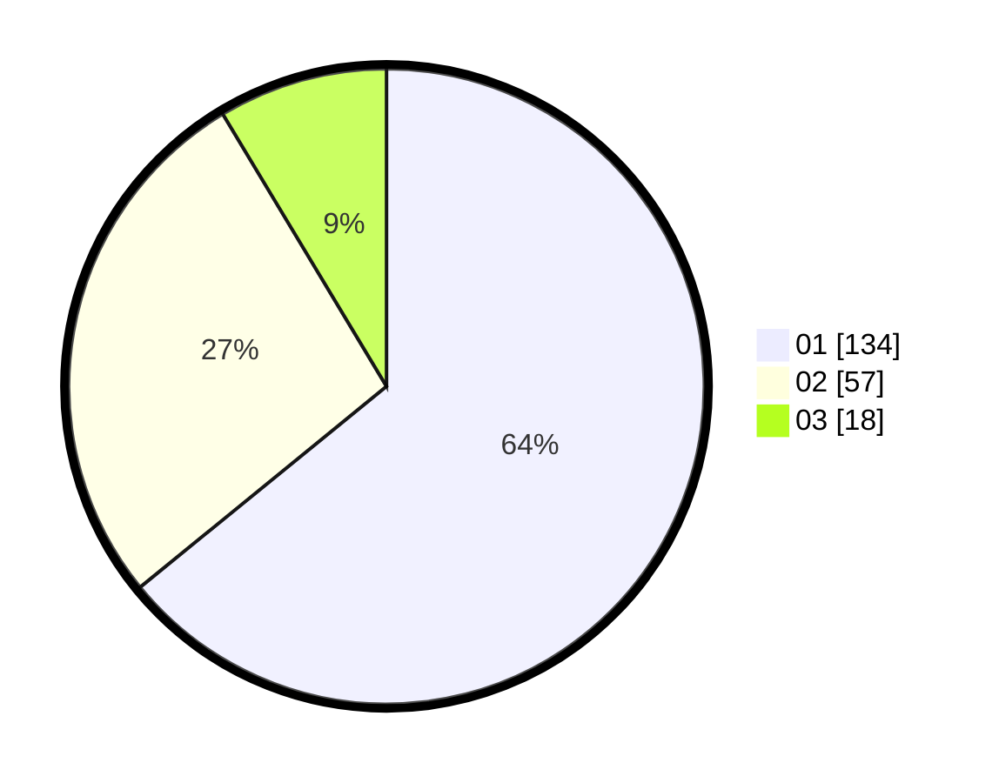

# Hasil

Hasil perolehan suara paslon dapat dilihat pada file paslon-01.txt, paslon-02.txt, dan paslon-03.txt.

Jika tidak ada, artinya data tersebut belum ada pada SIREKAP.

## Perolehan Suara

 * Paslon 01: **134**.
 * Paslon 02: **57**.
 * Paslon 03: **18**.

## Foto C Plano

https://sirekap-obj-formc.kpu.go.id/ff2b/pemilu/ppwp/31/71/07/10/04/3171071004089-20240214-155523--54429812-5c47-4217-bb3b-bb80088fd25c.jpg

https://sirekap-obj-formc.kpu.go.id/ff2b/pemilu/ppwp/31/71/07/10/04/3171071004089-20240214-155717--fbad498c-8922-4d7f-b8ac-05010dc24e54.jpg

https://sirekap-obj-formc.kpu.go.id/ff2b/pemilu/ppwp/31/71/07/10/04/3171071004089-20240214-155843--369fe1ab-c1c3-47b5-b84c-bb8570b75cce.jpg

## DATA PEMILIH TETAP

Jumlah pemilih dalam DPT: **276**.
 * L: **150**.
 * P: **126**.

## DATA PENGGUNA HAK PILIH

Jumlah pengguna hak pilih dalam DPT: **211**.
 * L: **113**.
 * P: **98**.

Jumlah pengguna hak pilih dalam DPTb: **0**.
 * L: **0**.
 * P: **0**.

Jumlah pengguna hak pilih dalam DPK: **1**.
 * L: **1**.
 * P: **0**.

Jumlah pengguna hak pilih: **212**.
 * L: **114**.
 * P: **98**.

## JUMLAH SUARA SAH DAN TIDAK SAH

JUMLAH SELURUH SUARA SAH: **209**.

JUMLAH SUARA TIDAK SAH: **3**.

JUMLAH SELURUH SUARA SAH DAN SUARA TIDAK SAH: **212**.
