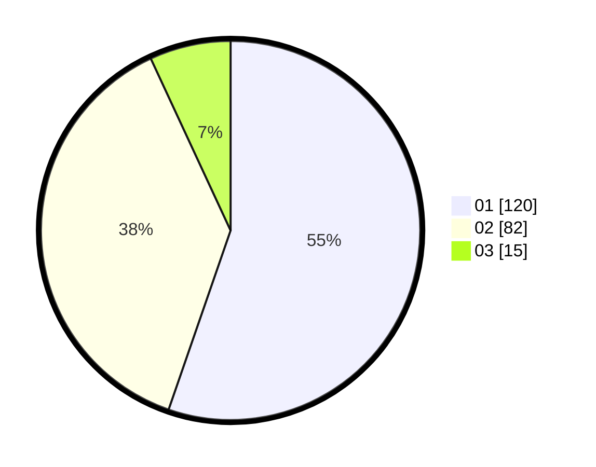

# Hasil

Hasil perolehan suara paslon dapat dilihat pada file paslon-01.txt, paslon-02.txt, dan paslon-03.txt.

Jika tidak ada, artinya data tersebut belum ada pada SIREKAP.

## Perolehan Suara

 * Paslon 01: **120**.
 * Paslon 02: **82**.
 * Paslon 03: **15**.

## Foto C Plano

https://sirekap-obj-formc.kpu.go.id/1eed/pemilu/ppwp/31/71/07/10/04/3171071004090-20240214-191925--3bc29adf-921f-4d94-902d-aaabceab493b.jpg

https://sirekap-obj-formc.kpu.go.id/1eed/pemilu/ppwp/31/71/07/10/04/3171071004090-20240214-192027--c1f11ea0-fab8-49f6-9aa1-8c9a4d3bcade.jpg

https://sirekap-obj-formc.kpu.go.id/1eed/pemilu/ppwp/31/71/07/10/04/3171071004090-20240214-192114--608204f3-3987-4df7-b3c7-54252c8dbb6b.jpg
