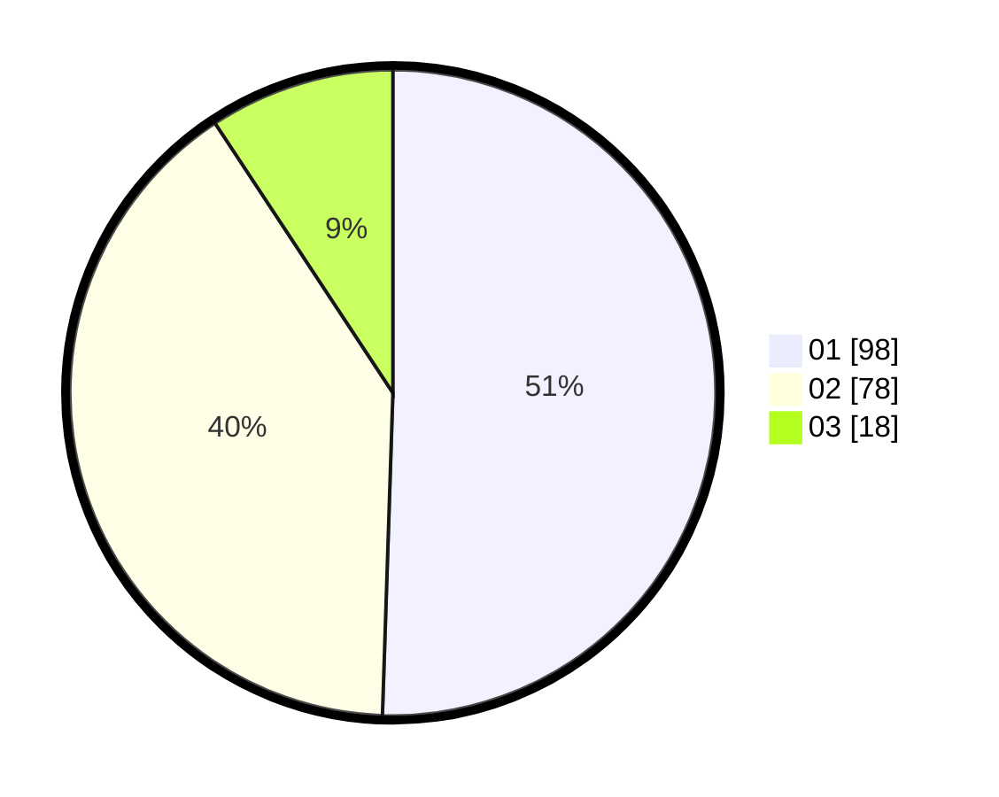

# Hasil

Hasil perolehan suara paslon dapat dilihat pada file paslon-01.txt, paslon-02.txt, dan paslon-03.txt.

Jika tidak ada, artinya data tersebut belum ada pada SIREKAP.

## Perolehan Suara

 * Paslon 01: **98**.
 * Paslon 02: **78**.
 * Paslon 03: **18**.

## Foto C Plano

https://sirekap-obj-formc.kpu.go.id/3124/pemilu/ppwp/31/71/07/10/04/3171071004093-20240216-104038--d2d2b06b-b1f6-46b1-be61-8c75f99e0114.jpg

https://sirekap-obj-formc.kpu.go.id/3124/pemilu/ppwp/31/71/07/10/04/3171071004093-20240216-153818--f82c53a9-e01d-4dd5-815e-9fca93139f5d.jpg

https://sirekap-obj-formc.kpu.go.id/3124/pemilu/ppwp/31/71/07/10/04/3171071004093-20240216-153922--6525de0f-11c0-47e7-b938-d443f5a55c0b.jpg

## DATA PEMILIH TETAP

Jumlah pemilih dalam DPT: **237**.
 * L: **119**.
 * P: **118**.

## DATA PENGGUNA HAK PILIH

Jumlah pengguna hak pilih dalam DPT: **187**.
 * L: **93**.
 * P: **94**.

Jumlah pengguna hak pilih dalam DPTb: **7**.
 * L: **0**.
 * P: **7**.

Jumlah pengguna hak pilih dalam DPK: **1**.
 * L: **1**.
 * P: **0**.

Jumlah pengguna hak pilih: **195**.
 * L: **94**.
 * P: **101**.

## JUMLAH SUARA SAH DAN TIDAK SAH

JUMLAH SELURUH SUARA SAH: **194**.

JUMLAH SUARA TIDAK SAH: **1**.

JUMLAH SELURUH SUARA SAH DAN SUARA TIDAK SAH: **195**.
