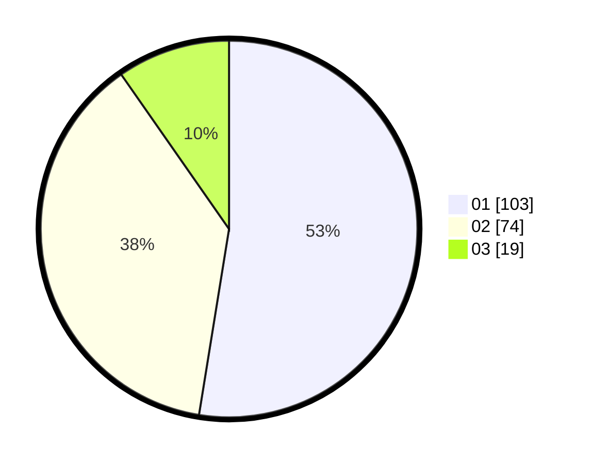

# Hasil

Hasil perolehan suara paslon dapat dilihat pada file paslon-01.txt, paslon-02.txt, dan paslon-03.txt.

Jika tidak ada, artinya data tersebut belum ada pada SIREKAP.

## Perolehan Suara

 * Paslon 01: **103**.
 * Paslon 02: **74**.
 * Paslon 03: **19**.

## Foto C Plano

https://sirekap-obj-formc.kpu.go.id/147f/pemilu/ppwp/31/71/07/10/04/3171071004096-20240214-191357--52856de9-f601-4743-9463-af438519bacd.jpg

https://sirekap-obj-formc.kpu.go.id/147f/pemilu/ppwp/31/71/07/10/04/3171071004096-20240214-191448--a6730457-c852-4a5f-b38f-78ca41e0ddc3.jpg

https://sirekap-obj-formc.kpu.go.id/147f/pemilu/ppwp/31/71/07/10/04/3171071004096-20240214-195920--1fcb951d-25aa-4c2f-a9ce-6b1153e1d158.jpg

## DATA PEMILIH TETAP

Jumlah pemilih dalam DPT: **259**.
 * L: **139**.
 * P: **120**.

## DATA PENGGUNA HAK PILIH

Jumlah pengguna hak pilih dalam DPT: **197**.
 * L: **104**.
 * P: **93**.

Jumlah pengguna hak pilih dalam DPTb: **0**.
 * L: **0**.
 * P: **0**.

Jumlah pengguna hak pilih dalam DPK: **1**.
 * L: **1**.
 * P: **0**.

Jumlah pengguna hak pilih: **198**.
 * L: **105**.
 * P: **93**.

## JUMLAH SUARA SAH DAN TIDAK SAH

JUMLAH SELURUH SUARA SAH: **196**.

JUMLAH SUARA TIDAK SAH: **2**.

JUMLAH SELURUH SUARA SAH DAN SUARA TIDAK SAH: **198**.
