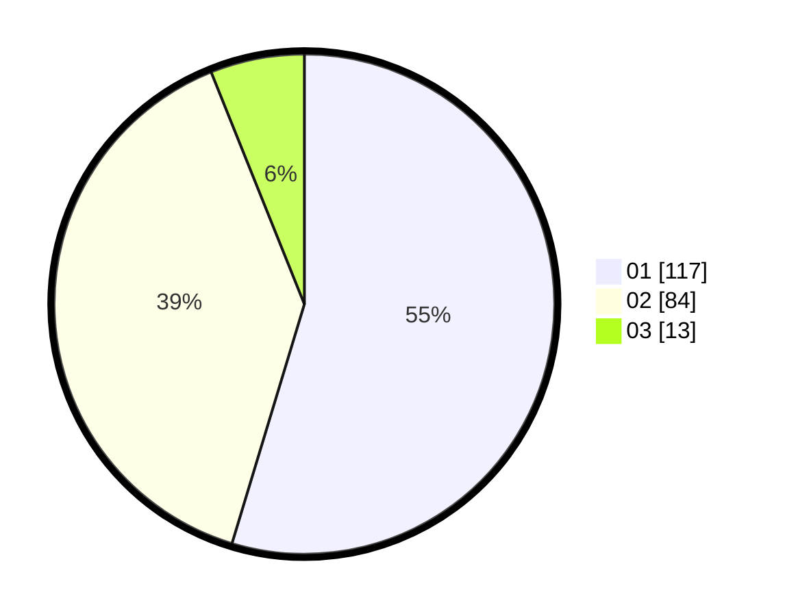

# Hasil

Hasil perolehan suara paslon dapat dilihat pada file paslon-01.txt, paslon-02.txt, dan paslon-03.txt.

Jika tidak ada, artinya data tersebut belum ada pada SIREKAP.

## Perolehan Suara

 * Paslon 01: **117**.
 * Paslon 02: **84**.
 * Paslon 03: **13**.

## Foto C Plano

https://sirekap-obj-formc.kpu.go.id/e803/pemilu/ppwp/31/71/07/10/04/3171071004099-20240214-155233--6fb22420-3c26-4da5-affe-bdf7f0994f97.jpg

https://sirekap-obj-formc.kpu.go.id/e803/pemilu/ppwp/31/71/07/10/04/3171071004099-20240214-155648--4c66471c-578f-4a33-a66d-f63cf5034831.jpg

https://sirekap-obj-formc.kpu.go.id/e803/pemilu/ppwp/31/71/07/10/04/3171071004099-20240214-160059--d84b5adc-4f49-4add-b3bb-ff7c3441d801.jpg
