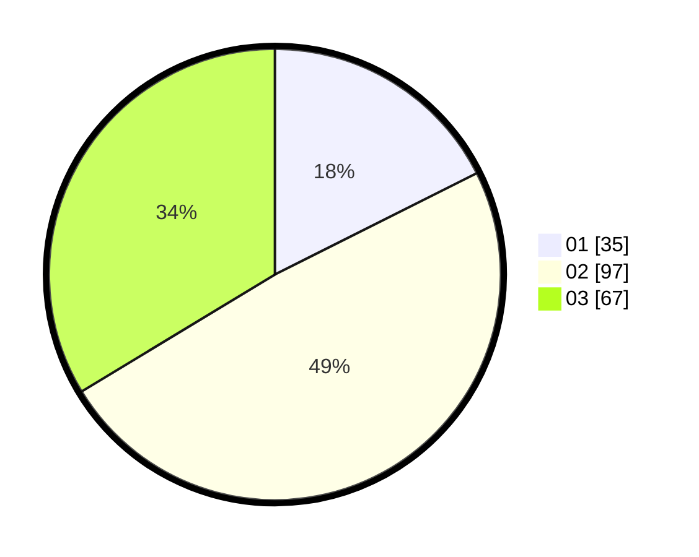

# Hasil

Hasil perolehan suara paslon dapat dilihat pada file paslon-01.txt, paslon-02.txt, dan paslon-03.txt.

Jika tidak ada, artinya data tersebut belum ada pada SIREKAP.

## Perolehan Suara

 * Paslon 01: **35**.
 * Paslon 02: **97**.
 * Paslon 03: **67**.

## Foto C Plano

https://sirekap-obj-formc.kpu.go.id/af6e/pemilu/ppwp/31/71/07/10/04/3171071004104-20240216-132349--28cae31c-1f5d-4ba9-9b91-00471065c499.jpg

https://sirekap-obj-formc.kpu.go.id/af6e/pemilu/ppwp/31/71/07/10/04/3171071004104-20240216-132350--43d43068-762e-4d4b-b9ec-5a18d48c4589.jpg

https://sirekap-obj-formc.kpu.go.id/af6e/pemilu/ppwp/31/71/07/10/04/3171071004104-20240216-132350--4a6e9eba-e411-4492-8063-2ff2fbb0bf81.jpg

## DATA PEMILIH TETAP

Jumlah pemilih dalam DPT: **255**.
 * L: **122**.
 * P: **133**.

## DATA PENGGUNA HAK PILIH

Jumlah pengguna hak pilih dalam DPT: **201**.
 * L: **92**.
 * P: **109**.

Jumlah pengguna hak pilih dalam DPTb: **0**.
 * L: **0**.
 * P: **0**.

Jumlah pengguna hak pilih dalam DPK: **3**.
 * L: **2**.
 * P: **1**.

Jumlah pengguna hak pilih: **204**.
 * L: **94**.
 * P: **110**.

## JUMLAH SUARA SAH DAN TIDAK SAH

JUMLAH SELURUH SUARA SAH: **199**.

JUMLAH SUARA TIDAK SAH: **5**.

JUMLAH SELURUH SUARA SAH DAN SUARA TIDAK SAH: **204**.
