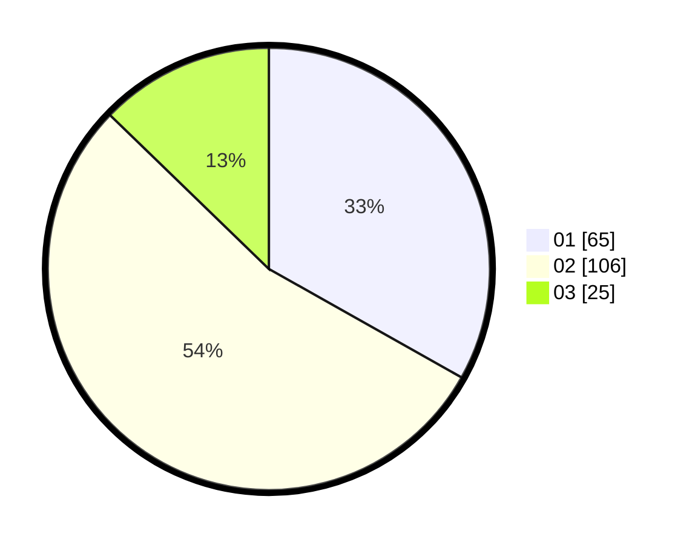

# Hasil

Hasil perolehan suara paslon dapat dilihat pada file paslon-01.txt, paslon-02.txt, dan paslon-03.txt.

Jika tidak ada, artinya data tersebut belum ada pada SIREKAP.

## Perolehan Suara

 * Paslon 01: **65**.
 * Paslon 02: **106**.
 * Paslon 03: **25**.

## Foto C Plano

https://sirekap-obj-formc.kpu.go.id/2f66/pemilu/ppwp/31/71/07/10/04/3171071004107-20240214-230323--34b652eb-5498-4e77-87b3-d81ad70fad99.jpg

https://sirekap-obj-formc.kpu.go.id/2f66/pemilu/ppwp/31/71/07/10/04/3171071004107-20240214-230501--fe6497ef-d19e-49ad-9caf-c57f1a33a5bd.jpg

https://sirekap-obj-formc.kpu.go.id/2f66/pemilu/ppwp/31/71/07/10/04/3171071004107-20240214-230658--9d658816-6e6e-4c2c-863f-9d24e9530d45.jpg

## DATA PEMILIH TETAP

Jumlah pemilih dalam DPT: **277**.
 * L: **154**.
 * P: **123**.

## DATA PENGGUNA HAK PILIH

Jumlah pengguna hak pilih dalam DPT: **199**.
 * L: **109**.
 * P: **90**.

Jumlah pengguna hak pilih dalam DPTb: **0**.
 * L: **0**.
 * P: **0**.

Jumlah pengguna hak pilih dalam DPK: **2**.
 * L: **0**.
 * P: **2**.

Jumlah pengguna hak pilih: **201**.
 * L: **109**.
 * P: **92**.

## JUMLAH SUARA SAH DAN TIDAK SAH

JUMLAH SELURUH SUARA SAH: **196**.

JUMLAH SUARA TIDAK SAH: **5**.

JUMLAH SELURUH SUARA SAH DAN SUARA TIDAK SAH: **201**.
