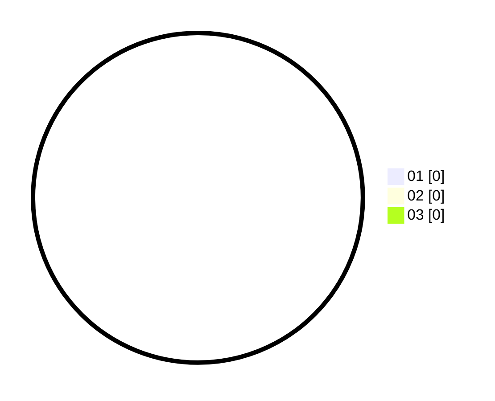

# Hasil

Hasil perolehan suara paslon dapat dilihat pada file paslon-01.txt, paslon-02.txt, dan paslon-03.txt.

Jika tidak ada, artinya data tersebut belum ada pada SIREKAP.

## Perolehan Suara

 * Paslon 01: **0**.
 * Paslon 02: **0**.
 * Paslon 03: **0**.

## Foto C Plano

https://sirekap-obj-formc.kpu.go.id/3955/pemilu/ppwp/31/71/07/10/04/3171071004111-20240214-233932--de68df56-8a46-478d-941a-2eb1e6b07fe8.jpg

https://sirekap-obj-formc.kpu.go.id/3955/pemilu/ppwp/31/71/07/10/04/3171071004111-20240214-234011--684119a3-cccf-401a-ad5e-64bc49caf4e5.jpg

https://sirekap-obj-formc.kpu.go.id/3955/pemilu/ppwp/31/71/07/10/04/3171071004111-20240214-234040--f732bfd2-15fe-4f74-82b5-9ffafbf9d2b2.jpg
