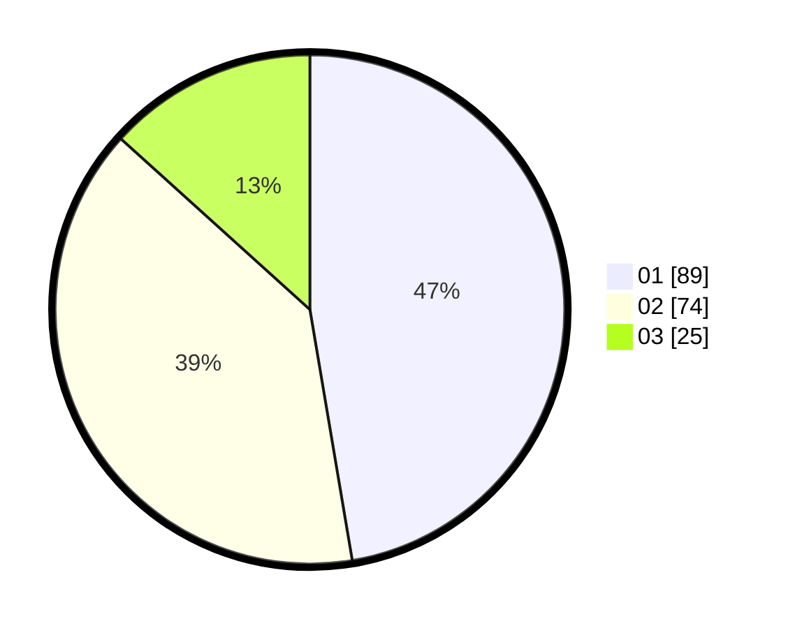

# Hasil

Hasil perolehan suara paslon dapat dilihat pada file paslon-01.txt, paslon-02.txt, dan paslon-03.txt.

Jika tidak ada, artinya data tersebut belum ada pada SIREKAP.

## Perolehan Suara

 * Paslon 01: **89**.
 * Paslon 02: **74**.
 * Paslon 03: **25**.

## Foto C Plano

https://sirekap-obj-formc.kpu.go.id/dbaa/pemilu/ppwp/31/71/07/10/04/3171071004112-20240214-210949--7fa5d69e-28ff-4d56-96c9-d649bb5d50ad.jpg

https://sirekap-obj-formc.kpu.go.id/dbaa/pemilu/ppwp/31/71/07/10/04/3171071004112-20240214-211113--4db1c189-77d6-46f4-bb4e-70dba53500f3.jpg

https://sirekap-obj-formc.kpu.go.id/dbaa/pemilu/ppwp/31/71/07/10/04/3171071004112-20240214-211321--0532d476-6807-4804-bfe9-e2ecf9b58fd3.jpg

## DATA PEMILIH TETAP

Jumlah pemilih dalam DPT: **248**.
 * L: **124**.
 * P: **124**.

## DATA PENGGUNA HAK PILIH

Jumlah pengguna hak pilih dalam DPT: **183**.
 * L: **92**.
 * P: **91**.

Jumlah pengguna hak pilih dalam DPTb: **5**.
 * L: **5**.
 * P: **0**.

Jumlah pengguna hak pilih dalam DPK: **4**.
 * L: **3**.
 * P: **1**.

Jumlah pengguna hak pilih: **192**.
 * L: **100**.
 * P: **92**.

## JUMLAH SUARA SAH DAN TIDAK SAH

JUMLAH SELURUH SUARA SAH: **188**.

JUMLAH SUARA TIDAK SAH: **4**.

JUMLAH SELURUH SUARA SAH DAN SUARA TIDAK SAH: **192**.
