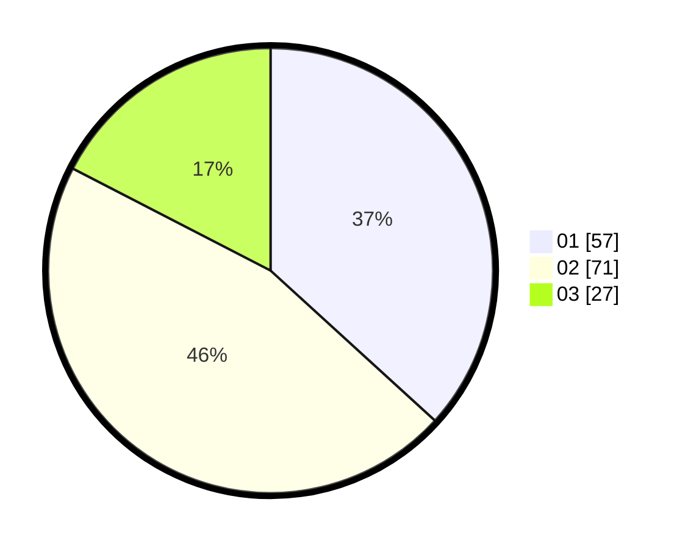

# Hasil

Hasil perolehan suara paslon dapat dilihat pada file paslon-01.txt, paslon-02.txt, dan paslon-03.txt.

Jika tidak ada, artinya data tersebut belum ada pada SIREKAP.

## Perolehan Suara

 * Paslon 01: **57**.
 * Paslon 02: **71**.
 * Paslon 03: **27**.

## Foto C Plano

https://sirekap-obj-formc.kpu.go.id/d371/pemilu/ppwp/31/71/07/10/04/3171071004113-20240214-222931--2ceabeb2-1027-44eb-aeae-cfbf230c84a0.jpg

https://sirekap-obj-formc.kpu.go.id/d371/pemilu/ppwp/31/71/07/10/04/3171071004113-20240214-223357--3306dcd3-85a1-4e2d-af64-1abdfe780e29.jpg

https://sirekap-obj-formc.kpu.go.id/d371/pemilu/ppwp/31/71/07/10/04/3171071004113-20240214-223543--b6af7e06-f0b5-4302-a913-16fa235ab2da.jpg

## DATA PEMILIH TETAP

Jumlah pemilih dalam DPT: **223**.
 * L: **113**.
 * P: **110**.

## DATA PENGGUNA HAK PILIH

Jumlah pengguna hak pilih dalam DPT: **146**.
 * L: **74**.
 * P: **72**.

Jumlah pengguna hak pilih dalam DPTb: **6**.
 * L: **3**.
 * P: **3**.

Jumlah pengguna hak pilih dalam DPK: **3**.
 * L: **3**.
 * P: **0**.

Jumlah pengguna hak pilih: **155**.
 * L: **80**.
 * P: **75**.

## JUMLAH SUARA SAH DAN TIDAK SAH

JUMLAH SELURUH SUARA SAH: **155**.

JUMLAH SUARA TIDAK SAH: **0**.

JUMLAH SELURUH SUARA SAH DAN SUARA TIDAK SAH: **155**.
