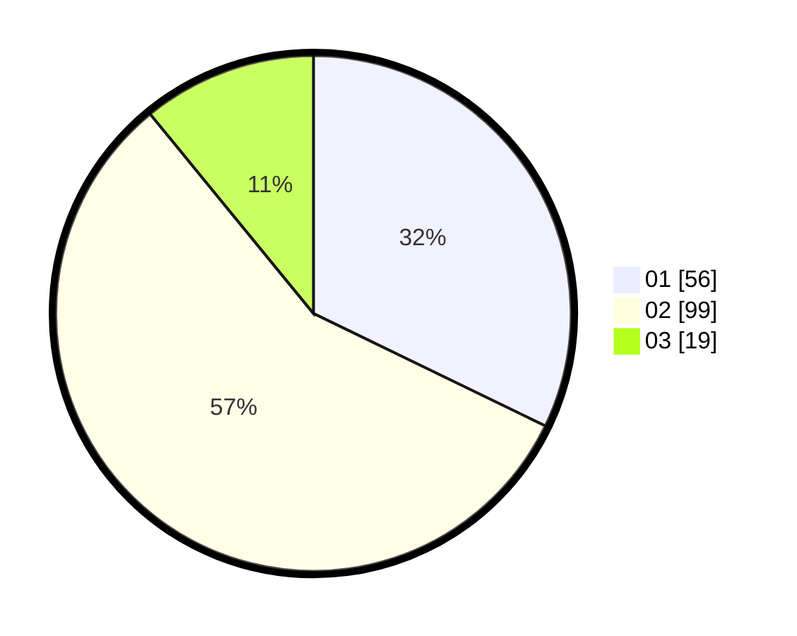

# Hasil

Hasil perolehan suara paslon dapat dilihat pada file paslon-01.txt, paslon-02.txt, dan paslon-03.txt.

Jika tidak ada, artinya data tersebut belum ada pada SIREKAP.

## Perolehan Suara

 * Paslon 01: **56**.
 * Paslon 02: **99**.
 * Paslon 03: **19**.

## Foto C Plano

https://sirekap-obj-formc.kpu.go.id/8a9c/pemilu/ppwp/31/71/07/10/04/3171071004114-20240214-232248--f63ed5c8-58ba-4908-b92f-767a457ee85e.jpg

https://sirekap-obj-formc.kpu.go.id/8a9c/pemilu/ppwp/31/71/07/10/04/3171071004114-20240214-232348--728528e7-5b55-444b-b53f-6c9256c0eb60.jpg

https://sirekap-obj-formc.kpu.go.id/8a9c/pemilu/ppwp/31/71/07/10/04/3171071004114-20240214-232448--0a01ce20-c57c-42d1-ba0c-960710ddd2db.jpg

## DATA PEMILIH TETAP

Jumlah pemilih dalam DPT: **277**.
 * L: **151**.
 * P: **126**.

## DATA PENGGUNA HAK PILIH

Jumlah pengguna hak pilih dalam DPT: **172**.
 * L: **97**.
 * P: **75**.

Jumlah pengguna hak pilih dalam DPTb: **5**.
 * L: **4**.
 * P: **1**.

Jumlah pengguna hak pilih dalam DPK: **3**.
 * L: **1**.
 * P: **2**.

Jumlah pengguna hak pilih: **180**.
 * L: **102**.
 * P: **78**.

## JUMLAH SUARA SAH DAN TIDAK SAH

JUMLAH SELURUH SUARA SAH: **174**.

JUMLAH SUARA TIDAK SAH: **6**.

JUMLAH SELURUH SUARA SAH DAN SUARA TIDAK SAH: **180**.
