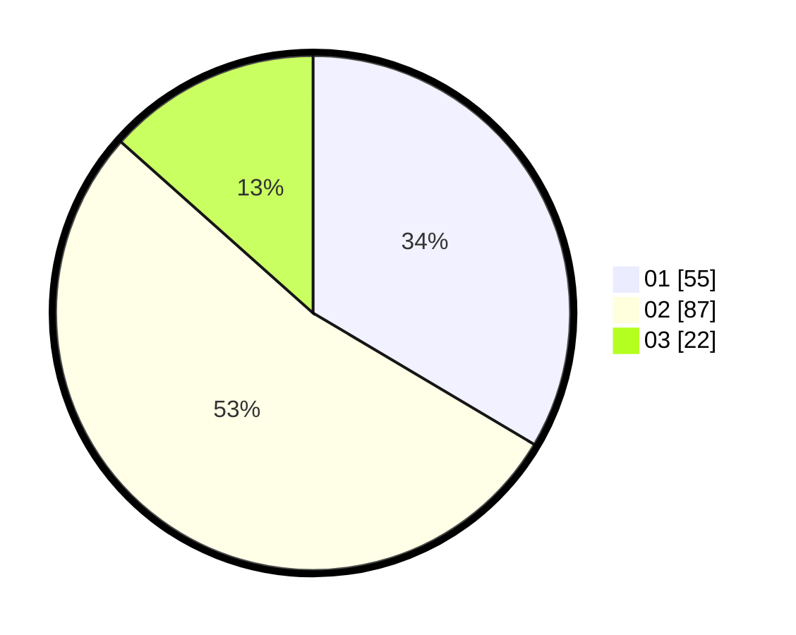

# Hasil

Hasil perolehan suara paslon dapat dilihat pada file paslon-01.txt, paslon-02.txt, dan paslon-03.txt.

Jika tidak ada, artinya data tersebut belum ada pada SIREKAP.

## Perolehan Suara

 * Paslon 01: **55**.
 * Paslon 02: **87**.
 * Paslon 03: **22**.

## Foto C Plano

https://sirekap-obj-formc.kpu.go.id/3e69/pemilu/ppwp/31/71/07/10/04/3171071004115-20240214-155252--787cbcf5-507f-4ebc-8829-62e8b355b9a0.jpg

https://sirekap-obj-formc.kpu.go.id/3e69/pemilu/ppwp/31/71/07/10/04/3171071004115-20240214-155326--ac898d44-4bf7-40cc-9583-17dada755cd4.jpg
