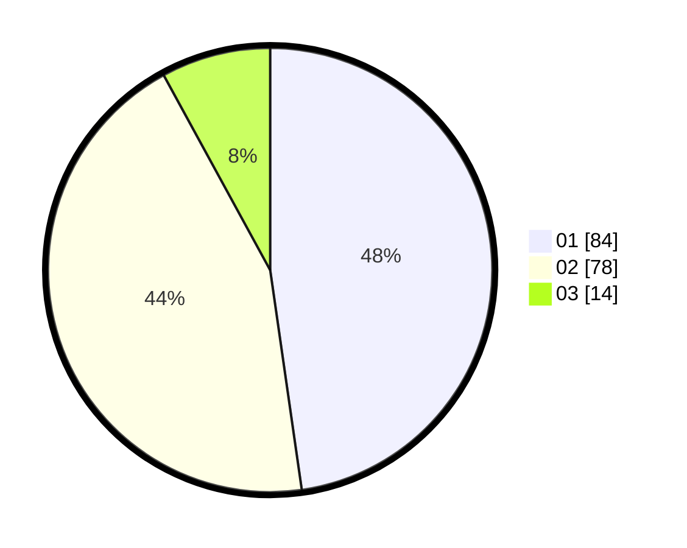

# Hasil

Hasil perolehan suara paslon dapat dilihat pada file paslon-01.txt, paslon-02.txt, dan paslon-03.txt.

Jika tidak ada, artinya data tersebut belum ada pada SIREKAP.

## Perolehan Suara

 * Paslon 01: **84**.
 * Paslon 02: **78**.
 * Paslon 03: **14**.

## Foto C Plano

https://sirekap-obj-formc.kpu.go.id/89f9/pemilu/ppwp/31/71/07/10/05/3171071005001-20240215-204541--391c88ef-62b8-4d45-96fa-b1c9790fae07.jpg

https://sirekap-obj-formc.kpu.go.id/89f9/pemilu/ppwp/31/71/07/10/05/3171071005001-20240215-204543--7d18b2e3-5d87-462b-80e0-cf532408bc53.jpg

https://sirekap-obj-formc.kpu.go.id/89f9/pemilu/ppwp/31/71/07/10/05/3171071005001-20240215-204542--8d9bd164-694e-4be7-9e0a-8b6dd3c486ad.jpg

## DATA PEMILIH TETAP

Jumlah pemilih dalam DPT: **275**.
 * L: **141**.
 * P: **134**.

## DATA PENGGUNA HAK PILIH

Jumlah pengguna hak pilih dalam DPT: **167**.
 * L: **75**.
 * P: **92**.

Jumlah pengguna hak pilih dalam DPTb: **12**.
 * L: **4**.
 * P: **8**.

Jumlah pengguna hak pilih dalam DPK: **0**.
 * L: **0**.
 * P: **0**.

Jumlah pengguna hak pilih: **179**.
 * L: **79**.
 * P: **100**.

## JUMLAH SUARA SAH DAN TIDAK SAH

JUMLAH SELURUH SUARA SAH: **176**.

JUMLAH SUARA TIDAK SAH: **3**.

JUMLAH SELURUH SUARA SAH DAN SUARA TIDAK SAH: **179**.
