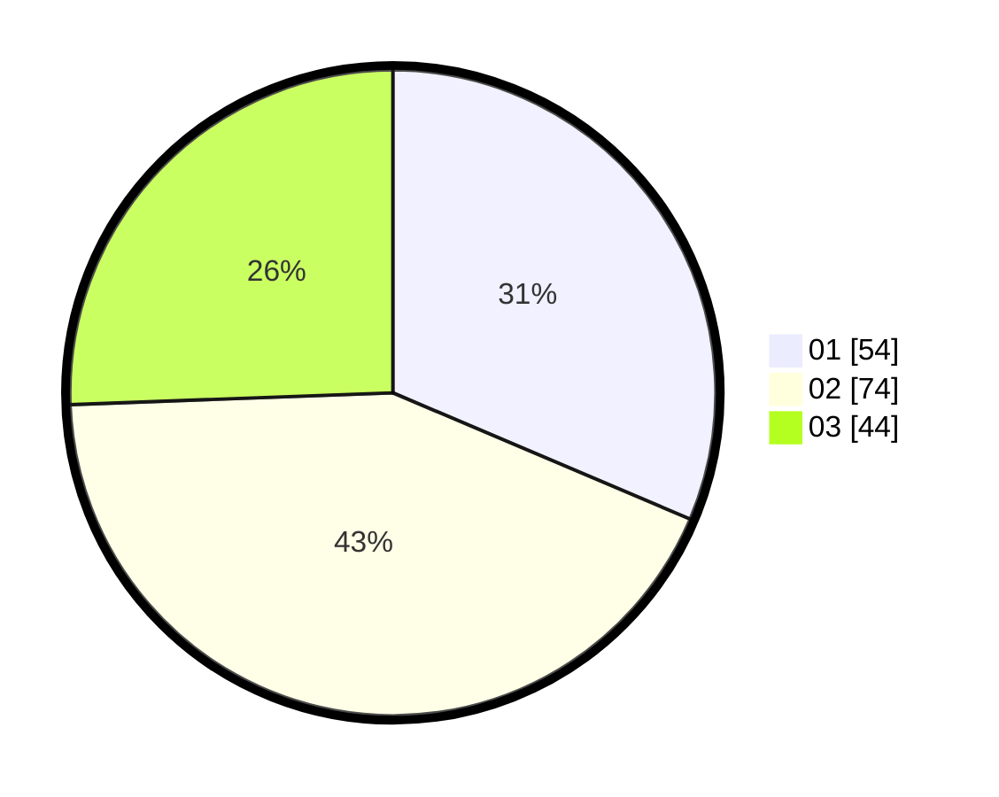

# Hasil

Hasil perolehan suara paslon dapat dilihat pada file paslon-01.txt, paslon-02.txt, dan paslon-03.txt.

Jika tidak ada, artinya data tersebut belum ada pada SIREKAP.

## Perolehan Suara

 * Paslon 01: **54**.
 * Paslon 02: **74**.
 * Paslon 03: **44**.

## Foto C Plano

https://sirekap-obj-formc.kpu.go.id/88ae/pemilu/ppwp/31/71/07/10/05/3171071005002-20240214-211155--f4115c4e-f1e9-4009-b047-155790cd854a.jpg

https://sirekap-obj-formc.kpu.go.id/88ae/pemilu/ppwp/31/71/07/10/05/3171071005002-20240214-202517--fcb26778-b823-4a9f-8de3-05dd9826fb9a.jpg

https://sirekap-obj-formc.kpu.go.id/88ae/pemilu/ppwp/31/71/07/10/05/3171071005002-20240214-202643--5fc0945f-2a09-429d-978b-c4d7e7aa2a5c.jpg

## DATA PEMILIH TETAP

Jumlah pemilih dalam DPT: **279**.
 * L: **146**.
 * P: **133**.

## DATA PENGGUNA HAK PILIH

Jumlah pengguna hak pilih dalam DPT: **172**.
 * L: **86**.
 * P: **86**.

Jumlah pengguna hak pilih dalam DPTb: **2**.
 * L: **1**.
 * P: **1**.

Jumlah pengguna hak pilih dalam DPK: **0**.
 * L: **0**.
 * P: **0**.

Jumlah pengguna hak pilih: **174**.
 * L: **87**.
 * P: **87**.

## JUMLAH SUARA SAH DAN TIDAK SAH

JUMLAH SELURUH SUARA SAH: **172**.

JUMLAH SUARA TIDAK SAH: **2**.

JUMLAH SELURUH SUARA SAH DAN SUARA TIDAK SAH: **174**.
