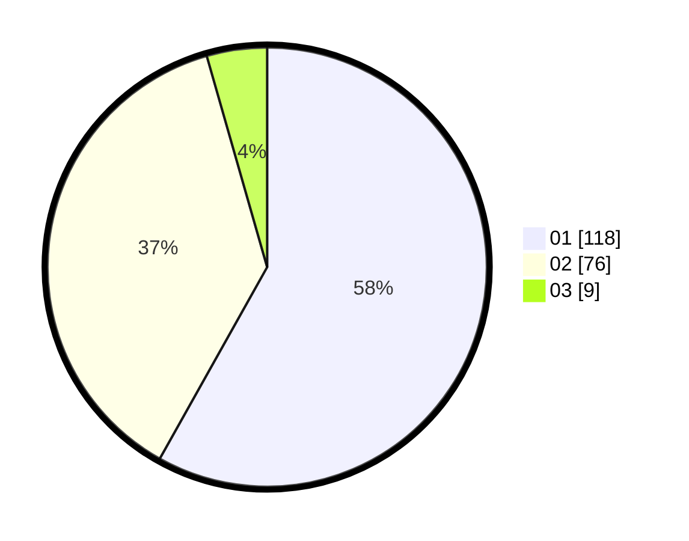

# Hasil

Hasil perolehan suara paslon dapat dilihat pada file paslon-01.txt, paslon-02.txt, dan paslon-03.txt.

Jika tidak ada, artinya data tersebut belum ada pada SIREKAP.

## Perolehan Suara

 * Paslon 01: **118**.
 * Paslon 02: **76**.
 * Paslon 03: **9**.

## Foto C Plano

https://sirekap-obj-formc.kpu.go.id/8746/pemilu/ppwp/31/71/07/10/05/3171071005010-20240215-233157--cf402f76-e955-4265-a44f-065da7015346.jpg

https://sirekap-obj-formc.kpu.go.id/8746/pemilu/ppwp/31/71/07/10/05/3171071005010-20240215-233159--335f7b8d-aa69-4d5c-b6d1-c6826f4d76ab.jpg

https://sirekap-obj-formc.kpu.go.id/8746/pemilu/ppwp/31/71/07/10/05/3171071005010-20240215-233158--42404a46-bb8e-494c-aade-2e4dd7ef4467.jpg

## DATA PEMILIH TETAP

Jumlah pemilih dalam DPT: **279**.
 * L: **137**.
 * P: **142**.

## DATA PENGGUNA HAK PILIH

Jumlah pengguna hak pilih dalam DPT: **196**.
 * L: **74**.
 * P: **122**.

Jumlah pengguna hak pilih dalam DPTb: **1**.
 * L: **1**.
 * P: **0**.

Jumlah pengguna hak pilih dalam DPK: **6**.
 * L: **4**.
 * P: **2**.

Jumlah pengguna hak pilih: **203**.
 * L: **79**.
 * P: **124**.

## JUMLAH SUARA SAH DAN TIDAK SAH

JUMLAH SELURUH SUARA SAH: **203**.

JUMLAH SUARA TIDAK SAH: **0**.

JUMLAH SELURUH SUARA SAH DAN SUARA TIDAK SAH: **203**.
