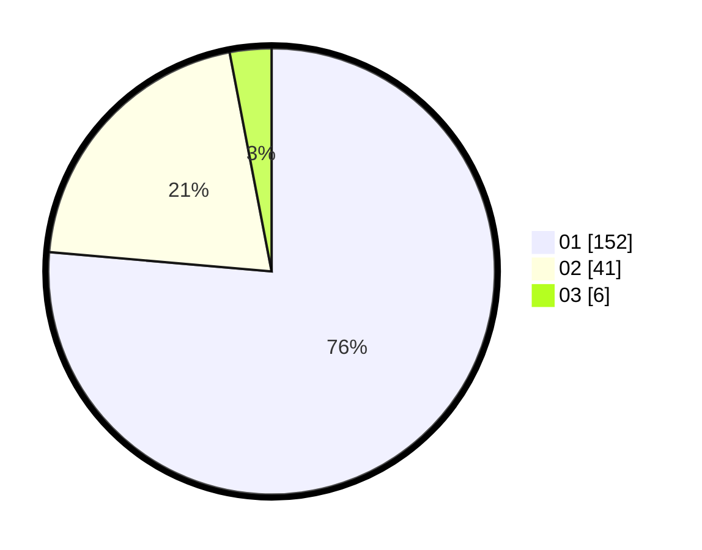

# Hasil

Hasil perolehan suara paslon dapat dilihat pada file paslon-01.txt, paslon-02.txt, dan paslon-03.txt.

Jika tidak ada, artinya data tersebut belum ada pada SIREKAP.

## Perolehan Suara

 * Paslon 01: **152**.
 * Paslon 02: **41**.
 * Paslon 03: **6**.

## Foto C Plano

https://sirekap-obj-formc.kpu.go.id/d793/pemilu/ppwp/31/71/07/10/05/3171071005011-20240214-155616--076446a1-43f0-40fe-95e6-97cb9419745b.jpg

https://sirekap-obj-formc.kpu.go.id/d793/pemilu/ppwp/31/71/07/10/05/3171071005011-20240214-155448--bc901f67-d641-46da-b126-69b291031f29.jpg

https://sirekap-obj-formc.kpu.go.id/d793/pemilu/ppwp/31/71/07/10/05/3171071005011-20240214-222651--fe556ff2-194f-43c6-86d4-0a944d8bf38f.jpg
