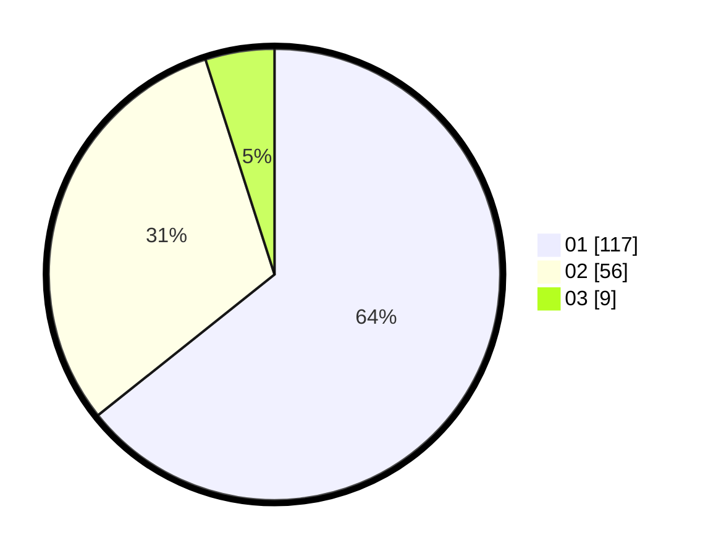

# Hasil

Hasil perolehan suara paslon dapat dilihat pada file paslon-01.txt, paslon-02.txt, dan paslon-03.txt.

Jika tidak ada, artinya data tersebut belum ada pada SIREKAP.

## Perolehan Suara

 * Paslon 01: **117**.
 * Paslon 02: **56**.
 * Paslon 03: **9**.

## Foto C Plano

https://sirekap-obj-formc.kpu.go.id/b013/pemilu/ppwp/31/71/07/10/05/3171071005013-20240214-205032--8c2ee587-f6f6-4e51-8a29-431008d58099.jpg

https://sirekap-obj-formc.kpu.go.id/b013/pemilu/ppwp/31/71/07/10/05/3171071005013-20240214-214215--b375659c-deef-4f11-bfed-7b561f988a9b.jpg

https://sirekap-obj-formc.kpu.go.id/b013/pemilu/ppwp/31/71/07/10/05/3171071005013-20240214-205042--e0db1f05-1e77-4e7c-950d-f445bce98cc5.jpg

## DATA PEMILIH TETAP

Jumlah pemilih dalam DPT: **268**.
 * L: **138**.
 * P: **130**.

## DATA PENGGUNA HAK PILIH

Jumlah pengguna hak pilih dalam DPT: **183**.
 * L: **93**.
 * P: **90**.

Jumlah pengguna hak pilih dalam DPTb: **0**.
 * L: **0**.
 * P: **0**.

Jumlah pengguna hak pilih dalam DPK: **0**.
 * L: **0**.
 * P: **0**.

Jumlah pengguna hak pilih: **183**.
 * L: **93**.
 * P: **90**.

## JUMLAH SUARA SAH DAN TIDAK SAH

JUMLAH SELURUH SUARA SAH: **182**.

JUMLAH SUARA TIDAK SAH: **1**.

JUMLAH SELURUH SUARA SAH DAN SUARA TIDAK SAH: **183**.
