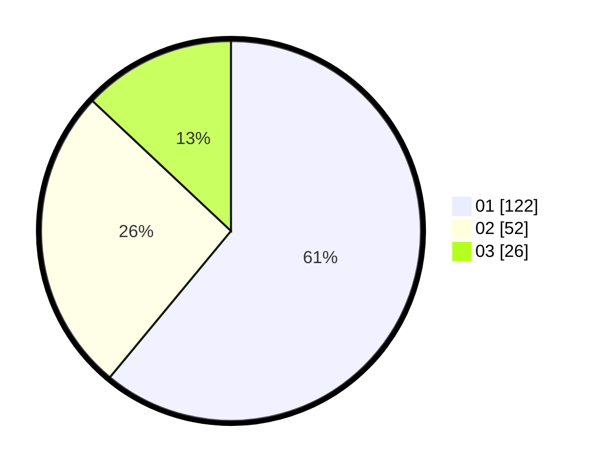

# Hasil

Hasil perolehan suara paslon dapat dilihat pada file paslon-01.txt, paslon-02.txt, dan paslon-03.txt.

Jika tidak ada, artinya data tersebut belum ada pada SIREKAP.

## Perolehan Suara

 * Paslon 01: **122**.
 * Paslon 02: **52**.
 * Paslon 03: **26**.

## Foto C Plano

https://sirekap-obj-formc.kpu.go.id/06f2/pemilu/ppwp/31/71/07/10/05/3171071005014-20240217-132126--25681d42-703a-4625-b302-67a51804e168.jpg

https://sirekap-obj-formc.kpu.go.id/06f2/pemilu/ppwp/31/71/07/10/05/3171071005014-20240217-140112--e472100a-95f0-4558-9450-84eb0aed4ea1.jpg
