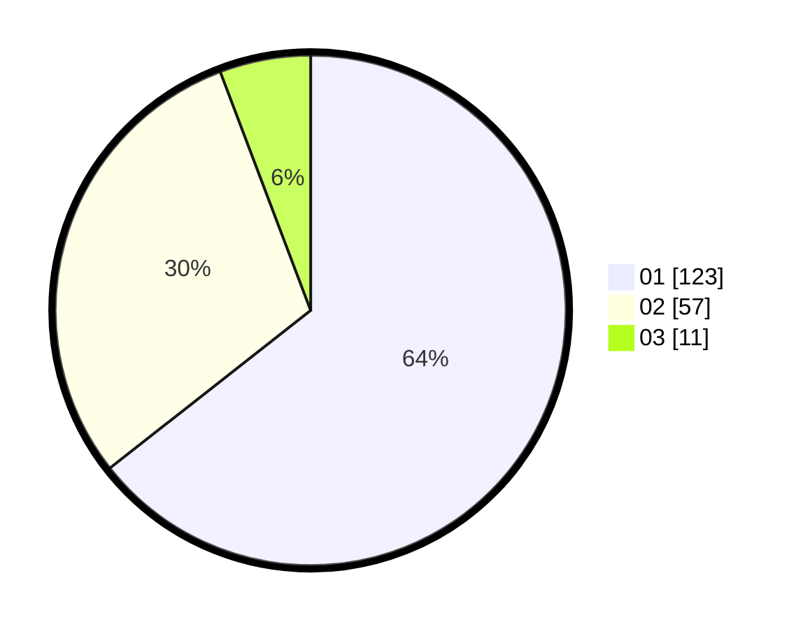

# Hasil

Hasil perolehan suara paslon dapat dilihat pada file paslon-01.txt, paslon-02.txt, dan paslon-03.txt.

Jika tidak ada, artinya data tersebut belum ada pada SIREKAP.

## Perolehan Suara

 * Paslon 01: **123**.
 * Paslon 02: **57**.
 * Paslon 03: **11**.

## Foto C Plano

https://sirekap-obj-formc.kpu.go.id/459b/pemilu/ppwp/31/71/07/10/05/3171071005016-20240214-184731--0dc47a7b-c6a0-4b1e-9ec2-d0fb22273e4b.jpg

https://sirekap-obj-formc.kpu.go.id/459b/pemilu/ppwp/31/71/07/10/05/3171071005016-20240214-184744--fbcce47f-5418-49d7-bb3e-11cb6260f1ae.jpg

https://sirekap-obj-formc.kpu.go.id/459b/pemilu/ppwp/31/71/07/10/05/3171071005016-20240214-184818--594b9dec-707e-48f2-bd92-f785071f01eb.jpg

## DATA PEMILIH TETAP

Jumlah pemilih dalam DPT: **280**.
 * L: **142**.
 * P: **138**.

## DATA PENGGUNA HAK PILIH

Jumlah pengguna hak pilih dalam DPT: **196**.
 * L: **100**.
 * P: **96**.

Jumlah pengguna hak pilih dalam DPTb: **0**.
 * L: **0**.
 * P: **0**.

Jumlah pengguna hak pilih dalam DPK: **0**.
 * L: **0**.
 * P: **0**.

Jumlah pengguna hak pilih: **196**.
 * L: **100**.
 * P: **96**.

## JUMLAH SUARA SAH DAN TIDAK SAH

JUMLAH SELURUH SUARA SAH: **191**.

JUMLAH SUARA TIDAK SAH: **5**.

JUMLAH SELURUH SUARA SAH DAN SUARA TIDAK SAH: **196**.
