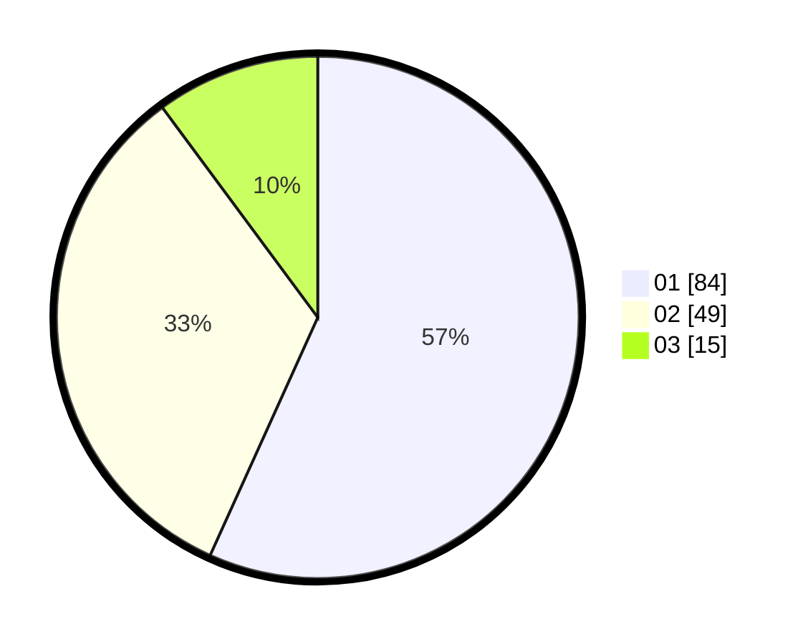

# Hasil

Hasil perolehan suara paslon dapat dilihat pada file paslon-01.txt, paslon-02.txt, dan paslon-03.txt.

Jika tidak ada, artinya data tersebut belum ada pada SIREKAP.

## Perolehan Suara

 * Paslon 01: **84**.
 * Paslon 02: **49**.
 * Paslon 03: **15**.

## Foto C Plano

https://sirekap-obj-formc.kpu.go.id/156b/pemilu/ppwp/31/71/07/10/05/3171071005018-20240214-203440--25f9ce60-827e-43bd-8148-b487a231ade0.jpg

https://sirekap-obj-formc.kpu.go.id/156b/pemilu/ppwp/31/71/07/10/05/3171071005018-20240214-205350--9376087e-d20c-4ef5-b0c6-6c8a882eb764.jpg
