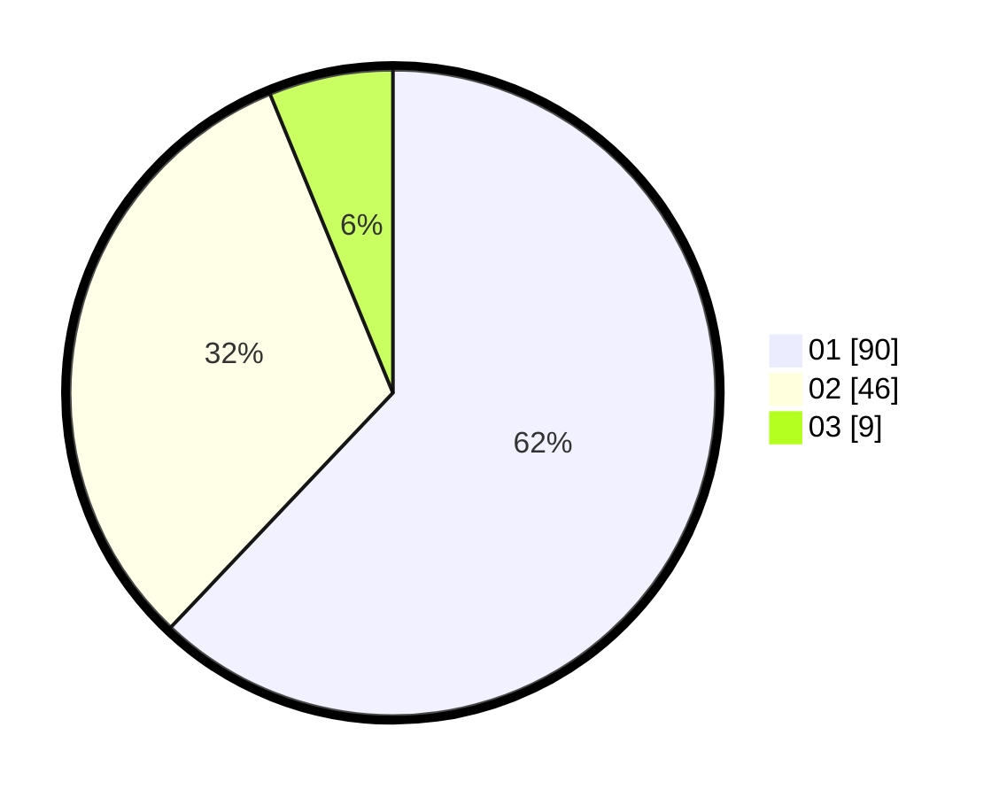

# Hasil

Hasil perolehan suara paslon dapat dilihat pada file paslon-01.txt, paslon-02.txt, dan paslon-03.txt.

Jika tidak ada, artinya data tersebut belum ada pada SIREKAP.

## Perolehan Suara

 * Paslon 01: **90**.
 * Paslon 02: **46**.
 * Paslon 03: **9**.

## Foto C Plano

https://sirekap-obj-formc.kpu.go.id/2f6d/pemilu/ppwp/31/71/07/10/05/3171071005019-20240214-224320--6f49e457-1966-4155-b24c-34a84292b8e5.jpg

https://sirekap-obj-formc.kpu.go.id/2f6d/pemilu/ppwp/31/71/07/10/05/3171071005019-20240214-224437--4ebcc651-0671-4d91-a609-bebf08ed2167.jpg

https://sirekap-obj-formc.kpu.go.id/2f6d/pemilu/ppwp/31/71/07/10/05/3171071005019-20240214-224606--6b3bb828-4498-4e3a-83ea-ffd21cbe9bc0.jpg
