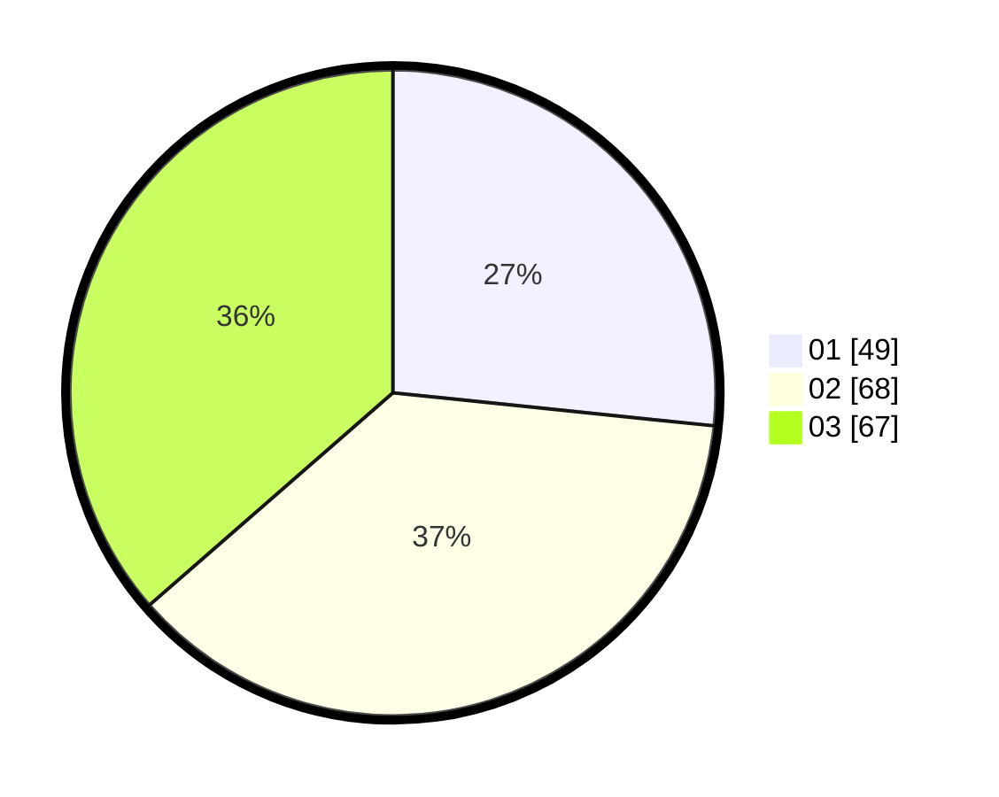

# Hasil

Hasil perolehan suara paslon dapat dilihat pada file paslon-01.txt, paslon-02.txt, dan paslon-03.txt.

Jika tidak ada, artinya data tersebut belum ada pada SIREKAP.

## Perolehan Suara

 * Paslon 01: **49**.
 * Paslon 02: **68**.
 * Paslon 03: **67**.

## Foto C Plano

https://sirekap-obj-formc.kpu.go.id/2c20/pemilu/ppwp/31/71/07/10/05/3171071005029-20240217-094258--acf67989-7ab9-4c36-b4a3-0dd3c5c08078.jpg

https://sirekap-obj-formc.kpu.go.id/2c20/pemilu/ppwp/31/71/07/10/05/3171071005029-20240217-094549--26be8101-390f-4f2c-8f09-68ae68be2c4d.jpg
