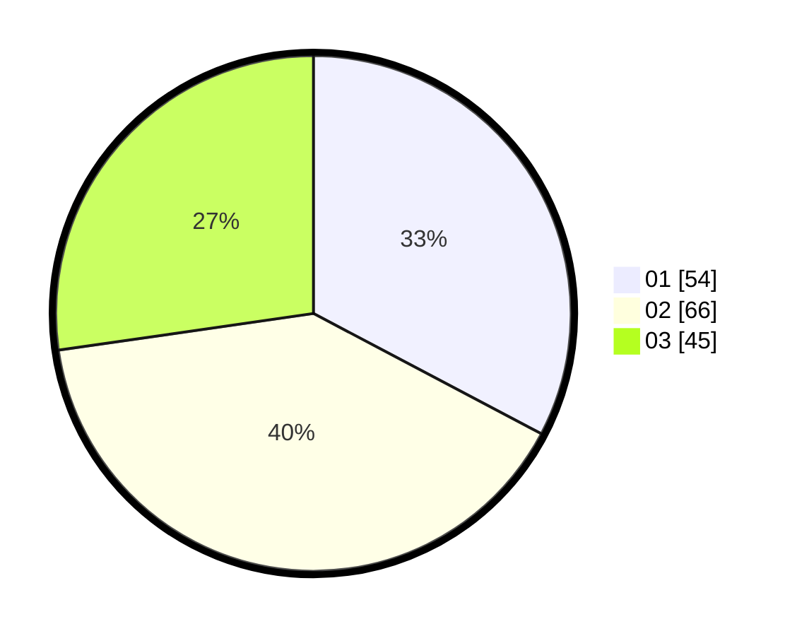

# Hasil

Hasil perolehan suara paslon dapat dilihat pada file paslon-01.txt, paslon-02.txt, dan paslon-03.txt.

Jika tidak ada, artinya data tersebut belum ada pada SIREKAP.

## Perolehan Suara

 * Paslon 01: **54**.
 * Paslon 02: **66**.
 * Paslon 03: **45**.

## Foto C Plano

https://sirekap-obj-formc.kpu.go.id/0c99/pemilu/ppwp/31/71/07/10/05/3171071005030-20240215-021342--a0265ac0-9133-4e10-b706-96d7d189b9ac.jpg

https://sirekap-obj-formc.kpu.go.id/0c99/pemilu/ppwp/31/71/07/10/05/3171071005030-20240215-021544--43e0ed05-0996-4f0f-bb68-09d66c3b22c9.jpg

https://sirekap-obj-formc.kpu.go.id/0c99/pemilu/ppwp/31/71/07/10/05/3171071005030-20240215-021654--16e72321-06cd-43b8-8918-136dcaff2a5f.jpg
