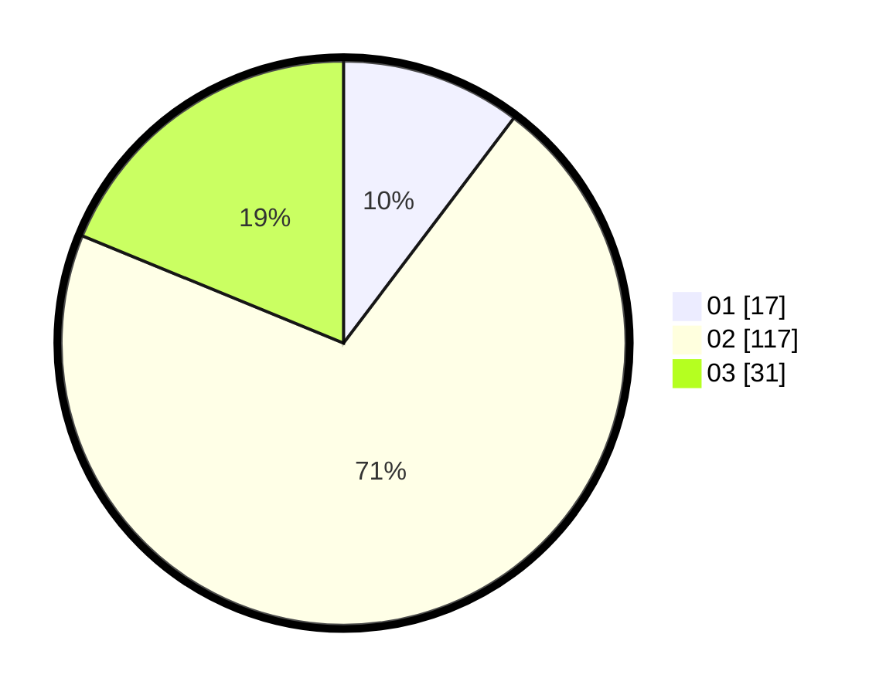

# Hasil

Hasil perolehan suara paslon dapat dilihat pada file paslon-01.txt, paslon-02.txt, dan paslon-03.txt.

Jika tidak ada, artinya data tersebut belum ada pada SIREKAP.

## Perolehan Suara

 * Paslon 01: **17**.
 * Paslon 02: **117**.
 * Paslon 03: **31**.

## Foto C Plano

https://sirekap-obj-formc.kpu.go.id/9fcd/pemilu/ppwp/31/71/07/10/05/3171071005032-20240214-194833--5854d230-ce28-41b8-8b9e-3c742b3ed61f.jpg

https://sirekap-obj-formc.kpu.go.id/9fcd/pemilu/ppwp/31/71/07/10/05/3171071005032-20240214-191656--da210c56-242f-40ee-99d5-2624b2bcf0f2.jpg

https://sirekap-obj-formc.kpu.go.id/9fcd/pemilu/ppwp/31/71/07/10/05/3171071005032-20240214-191841--39882a97-9bd1-403c-a29b-2e7112fa03db.jpg
