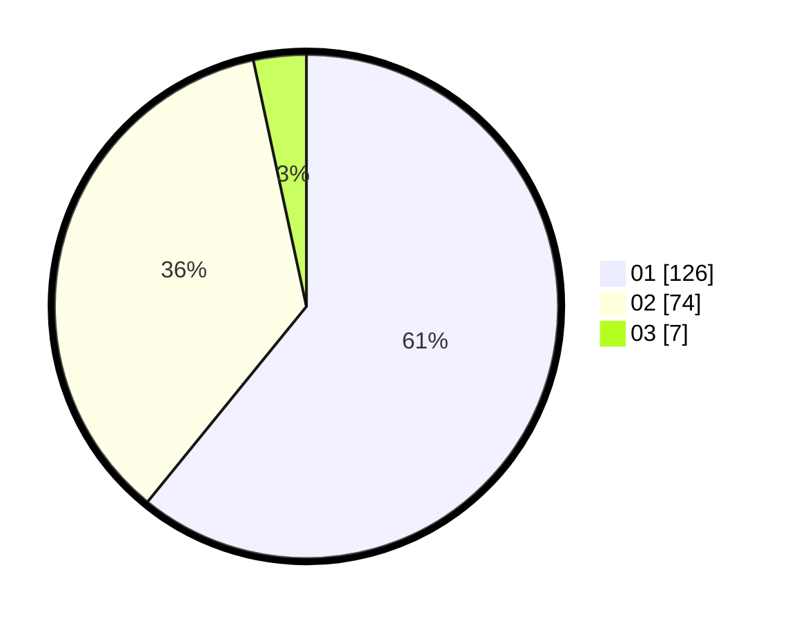

# Hasil

Hasil perolehan suara paslon dapat dilihat pada file paslon-01.txt, paslon-02.txt, dan paslon-03.txt.

Jika tidak ada, artinya data tersebut belum ada pada SIREKAP.

## Perolehan Suara

 * Paslon 01: **126**.
 * Paslon 02: **74**.
 * Paslon 03: **7**.

## Foto C Plano

https://sirekap-obj-formc.kpu.go.id/9687/pemilu/ppwp/31/71/07/10/05/3171071005039-20240214-233152--06b736fd-a23b-4bc7-a43d-bd1743ba5021.jpg

https://sirekap-obj-formc.kpu.go.id/9687/pemilu/ppwp/31/71/07/10/05/3171071005039-20240214-233301--43da8dda-7989-4526-99ef-8a5acc8657c6.jpg

https://sirekap-obj-formc.kpu.go.id/9687/pemilu/ppwp/31/71/07/10/05/3171071005039-20240214-233348--30d3e9a9-b1d1-4595-ae6c-3f248deaf466.jpg

## DATA PEMILIH TETAP

Jumlah pemilih dalam DPT: **271**.
 * L: **133**.
 * P: **138**.

## DATA PENGGUNA HAK PILIH

Jumlah pengguna hak pilih dalam DPT: **209**.
 * L: **101**.
 * P: **108**.

Jumlah pengguna hak pilih dalam DPTb: **0**.
 * L: **0**.
 * P: **0**.

Jumlah pengguna hak pilih dalam DPK: **0**.
 * L: **0**.
 * P: **0**.

Jumlah pengguna hak pilih: **209**.
 * L: **501**.
 * P: **108**.

## JUMLAH SUARA SAH DAN TIDAK SAH

JUMLAH SELURUH SUARA SAH: **207**.

JUMLAH SUARA TIDAK SAH: **2**.

JUMLAH SELURUH SUARA SAH DAN SUARA TIDAK SAH: **209**.
