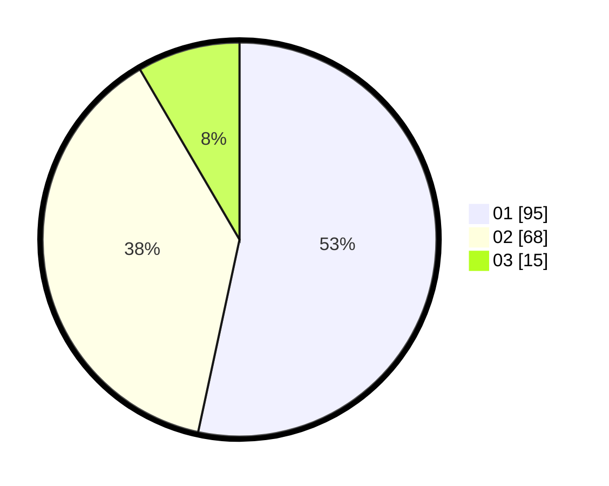

# Hasil

Hasil perolehan suara paslon dapat dilihat pada file paslon-01.txt, paslon-02.txt, dan paslon-03.txt.

Jika tidak ada, artinya data tersebut belum ada pada SIREKAP.

## Perolehan Suara

 * Paslon 01: **95**.
 * Paslon 02: **68**.
 * Paslon 03: **15**.

## Foto C Plano

https://sirekap-obj-formc.kpu.go.id/6e78/pemilu/ppwp/31/71/07/10/05/3171071005047-20240214-203832--4d7a6328-9e08-44bb-b2c6-a3e4c0fc569b.jpg

https://sirekap-obj-formc.kpu.go.id/6e78/pemilu/ppwp/31/71/07/10/05/3171071005047-20240214-213639--a3c007e3-f1f1-4cba-8469-a91b2125a061.jpg

https://sirekap-obj-formc.kpu.go.id/6e78/pemilu/ppwp/31/71/07/10/05/3171071005047-20240214-213451--ed57e313-db95-4961-a6fb-5cad65b7c21f.jpg

## DATA PEMILIH TETAP

Jumlah pemilih dalam DPT: **238**.
 * L: **127**.
 * P: **111**.

## DATA PENGGUNA HAK PILIH

Jumlah pengguna hak pilih dalam DPT: **177**.
 * L: **91**.
 * P: **86**.

Jumlah pengguna hak pilih dalam DPTb: **3**.
 * L: **2**.
 * P: **1**.

Jumlah pengguna hak pilih dalam DPK: **0**.
 * L: **0**.
 * P: **0**.

Jumlah pengguna hak pilih: **180**.
 * L: **93**.
 * P: **87**.

## JUMLAH SUARA SAH DAN TIDAK SAH

JUMLAH SELURUH SUARA SAH: **178**.

JUMLAH SUARA TIDAK SAH: **2**.

JUMLAH SELURUH SUARA SAH DAN SUARA TIDAK SAH: **180**.
