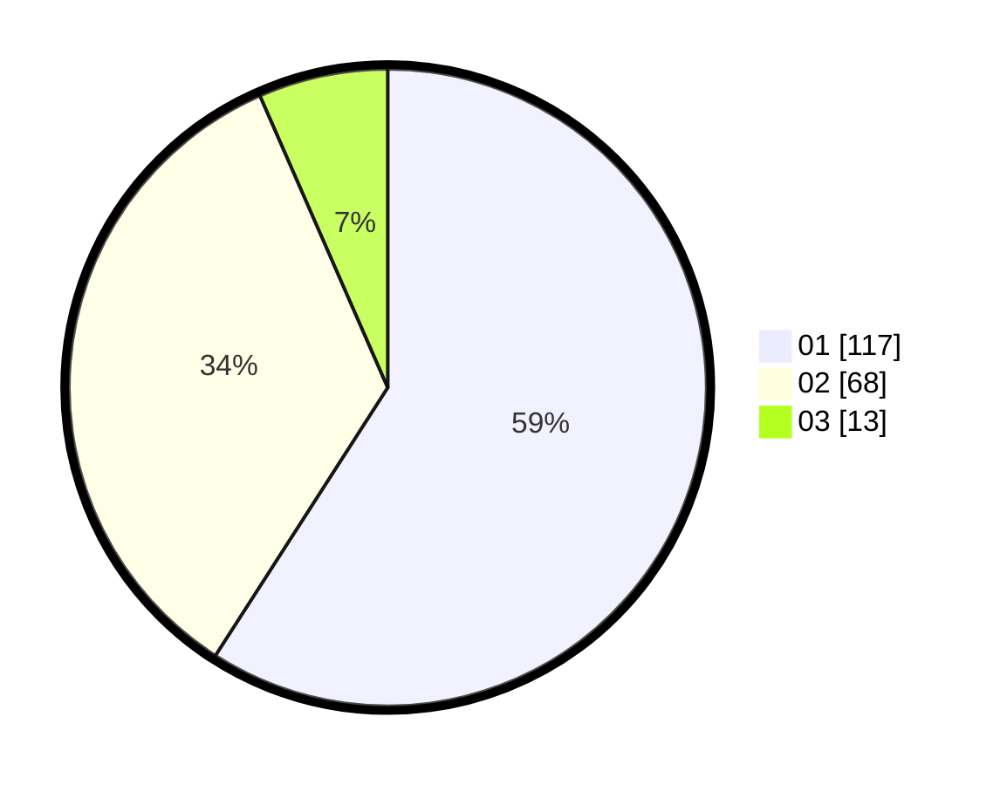

# Hasil

Hasil perolehan suara paslon dapat dilihat pada file paslon-01.txt, paslon-02.txt, dan paslon-03.txt.

Jika tidak ada, artinya data tersebut belum ada pada SIREKAP.

## Perolehan Suara

 * Paslon 01: **117**.
 * Paslon 02: **68**.
 * Paslon 03: **13**.

## Foto C Plano

https://sirekap-obj-formc.kpu.go.id/af9a/pemilu/ppwp/31/71/07/10/05/3171071005048-20240214-185507--e32ad538-25a7-4d6e-8901-72297655a4ac.jpg

https://sirekap-obj-formc.kpu.go.id/af9a/pemilu/ppwp/31/71/07/10/05/3171071005048-20240214-185517--2f4abd72-14ca-4817-87bc-1d77720ffc1f.jpg

https://sirekap-obj-formc.kpu.go.id/af9a/pemilu/ppwp/31/71/07/10/05/3171071005048-20240214-185525--933fc34d-628e-470e-a471-6a6e87c5cdab.jpg

## DATA PEMILIH TETAP

Jumlah pemilih dalam DPT: **258**.
 * L: **132**.
 * P: **126**.

## DATA PENGGUNA HAK PILIH

Jumlah pengguna hak pilih dalam DPT: **196**.
 * L: **96**.
 * P: **100**.

Jumlah pengguna hak pilih dalam DPTb: **2**.
 * L: **1**.
 * P: **1**.

Jumlah pengguna hak pilih dalam DPK: **1**.
 * L: **0**.
 * P: **1**.

Jumlah pengguna hak pilih: **199**.
 * L: **97**.
 * P: **102**.

## JUMLAH SUARA SAH DAN TIDAK SAH

JUMLAH SELURUH SUARA SAH: **198**.

JUMLAH SUARA TIDAK SAH: **1**.

JUMLAH SELURUH SUARA SAH DAN SUARA TIDAK SAH: **199**.
