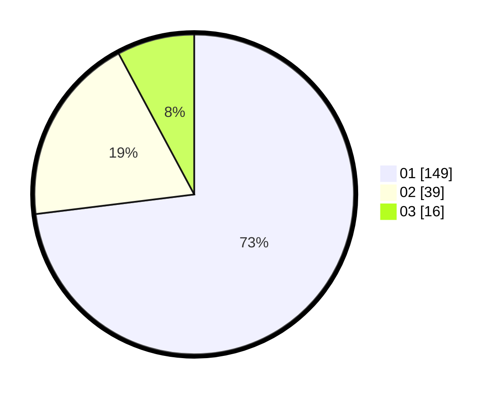

# Hasil

Hasil perolehan suara paslon dapat dilihat pada file paslon-01.txt, paslon-02.txt, dan paslon-03.txt.

Jika tidak ada, artinya data tersebut belum ada pada SIREKAP.

## Perolehan Suara

 * Paslon 01: **149**.
 * Paslon 02: **39**.
 * Paslon 03: **16**.

## Foto C Plano

https://sirekap-obj-formc.kpu.go.id/474e/pemilu/ppwp/31/71/07/10/05/3171071005050-20240214-221900--8112b42d-1878-4079-89d9-abd0e9077af6.jpg

https://sirekap-obj-formc.kpu.go.id/474e/pemilu/ppwp/31/71/07/10/05/3171071005050-20240214-222340--7da7d387-e8e6-4a37-8bc4-72598a32efaa.jpg

https://sirekap-obj-formc.kpu.go.id/474e/pemilu/ppwp/31/71/07/10/05/3171071005050-20240214-222749--466671db-e4eb-4485-a258-ab69b3a7861f.jpg
