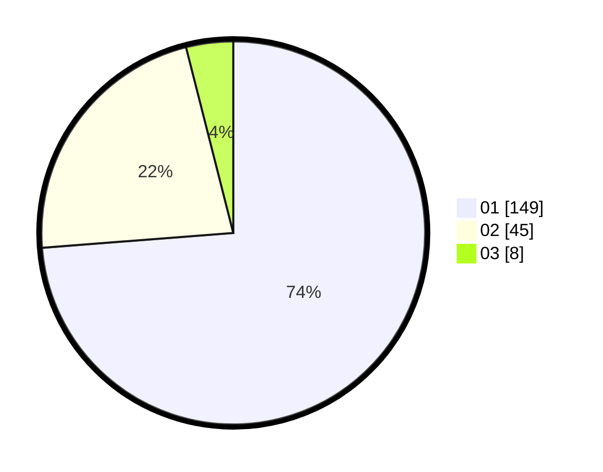

# Hasil

Hasil perolehan suara paslon dapat dilihat pada file paslon-01.txt, paslon-02.txt, dan paslon-03.txt.

Jika tidak ada, artinya data tersebut belum ada pada SIREKAP.

## Perolehan Suara

 * Paslon 01: **149**.
 * Paslon 02: **45**.
 * Paslon 03: **8**.

## Foto C Plano

https://sirekap-obj-formc.kpu.go.id/90a2/pemilu/ppwp/31/71/07/10/05/3171071005051-20240215-001329--97a0e9c0-ce32-4756-9d47-416bd63953c8.jpg

https://sirekap-obj-formc.kpu.go.id/90a2/pemilu/ppwp/31/71/07/10/05/3171071005051-20240215-001518--2fca7631-de14-4bff-8f29-4fd4e4e45f4a.jpg

https://sirekap-obj-formc.kpu.go.id/90a2/pemilu/ppwp/31/71/07/10/05/3171071005051-20240215-001644--2d4d0030-4ae1-4d2c-9073-43acba4ae143.jpg
