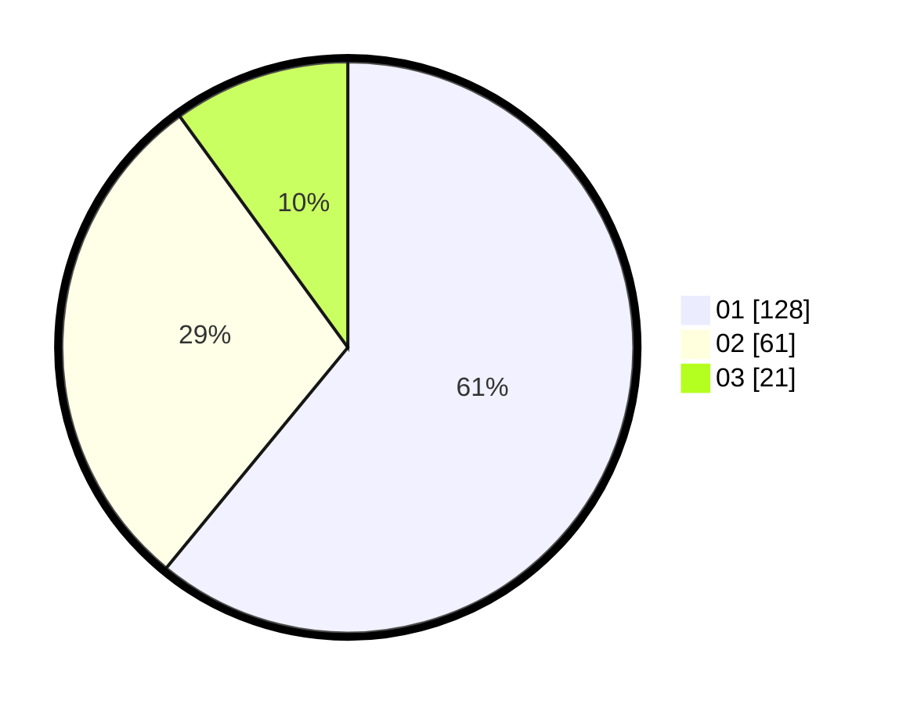

# Hasil

Hasil perolehan suara paslon dapat dilihat pada file paslon-01.txt, paslon-02.txt, dan paslon-03.txt.

Jika tidak ada, artinya data tersebut belum ada pada SIREKAP.

## Perolehan Suara

 * Paslon 01: **128**.
 * Paslon 02: **61**.
 * Paslon 03: **21**.

## Foto C Plano

https://sirekap-obj-formc.kpu.go.id/c25e/pemilu/ppwp/31/71/07/10/05/3171071005058-20240216-021923--9f2fa747-35ca-44fa-b4e4-ab3e74a04ab1.jpg

https://sirekap-obj-formc.kpu.go.id/c25e/pemilu/ppwp/31/71/07/10/05/3171071005058-20240216-021924--eb964668-95f5-40e4-9f64-b4e264c36dbd.jpg

https://sirekap-obj-formc.kpu.go.id/c25e/pemilu/ppwp/31/71/07/10/05/3171071005058-20240216-021923--e7132a53-e3c2-456d-82ce-63fc5d44d742.jpg

## DATA PEMILIH TETAP

Jumlah pemilih dalam DPT: **271**.
 * L: **140**.
 * P: **131**.

## DATA PENGGUNA HAK PILIH

Jumlah pengguna hak pilih dalam DPT: **210**.
 * L: **108**.
 * P: **102**.

Jumlah pengguna hak pilih dalam DPTb: **2**.
 * L: **1**.
 * P: **1**.

Jumlah pengguna hak pilih dalam DPK: **3**.
 * L: **0**.
 * P: **3**.

Jumlah pengguna hak pilih: **215**.
 * L: **109**.
 * P: **106**.

## JUMLAH SUARA SAH DAN TIDAK SAH

JUMLAH SELURUH SUARA SAH: **210**.

JUMLAH SUARA TIDAK SAH: **5**.

JUMLAH SELURUH SUARA SAH DAN SUARA TIDAK SAH: **215**.
