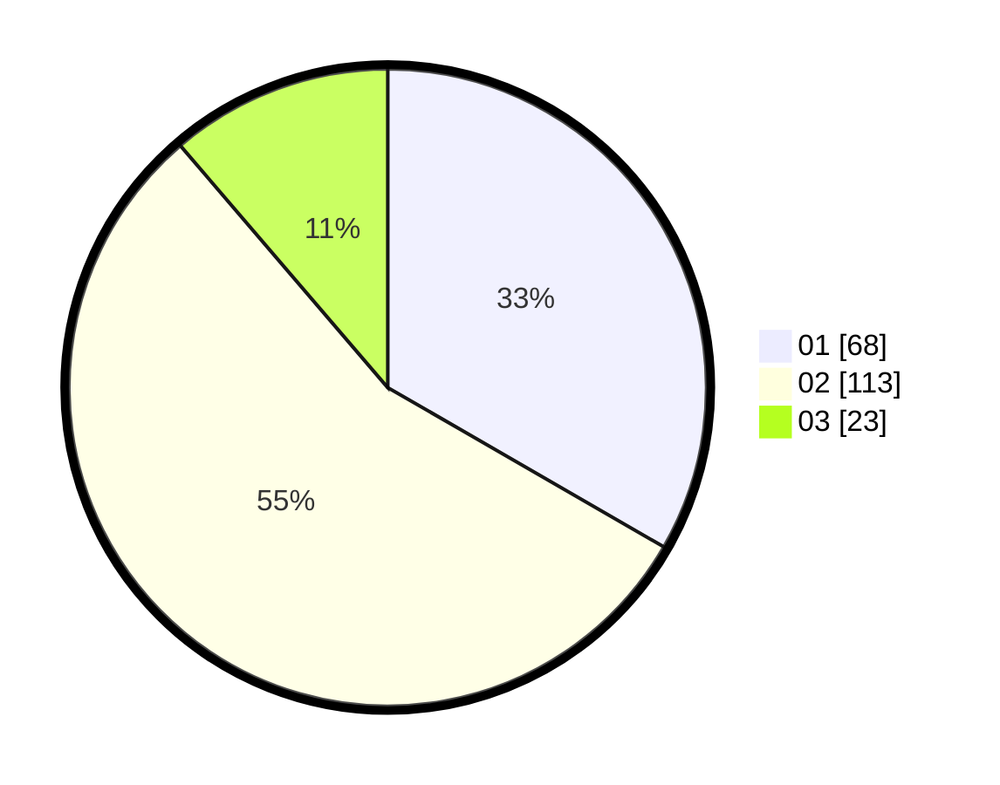

# Hasil

Hasil perolehan suara paslon dapat dilihat pada file paslon-01.txt, paslon-02.txt, dan paslon-03.txt.

Jika tidak ada, artinya data tersebut belum ada pada SIREKAP.

## Perolehan Suara

 * Paslon 01: **68**.
 * Paslon 02: **113**.
 * Paslon 03: **23**.

## Foto C Plano

https://sirekap-obj-formc.kpu.go.id/7ce3/pemilu/ppwp/31/71/07/10/05/3171071005065-20240215-011248--63beb3c9-a460-4490-89ae-e174c7aadfc5.jpg

https://sirekap-obj-formc.kpu.go.id/7ce3/pemilu/ppwp/31/71/07/10/05/3171071005065-20240215-011323--4c421433-5a59-4acc-a252-a3fed07d90f5.jpg

https://sirekap-obj-formc.kpu.go.id/7ce3/pemilu/ppwp/31/71/07/10/05/3171071005065-20240215-011404--f7f0ff51-15ae-4db4-a5a0-91dc3e30f388.jpg

## DATA PEMILIH TETAP

Jumlah pemilih dalam DPT: **280**.
 * L: **148**.
 * P: **132**.

## DATA PENGGUNA HAK PILIH

Jumlah pengguna hak pilih dalam DPT: **195**.
 * L: **101**.
 * P: **94**.

Jumlah pengguna hak pilih dalam DPTb: **6**.
 * L: **3**.
 * P: **3**.

Jumlah pengguna hak pilih dalam DPK: **5**.
 * L: **3**.
 * P: **2**.

Jumlah pengguna hak pilih: **206**.
 * L: **107**.
 * P: **99**.

## JUMLAH SUARA SAH DAN TIDAK SAH

JUMLAH SELURUH SUARA SAH: **204**.

JUMLAH SUARA TIDAK SAH: **2**.

JUMLAH SELURUH SUARA SAH DAN SUARA TIDAK SAH: **206**.
