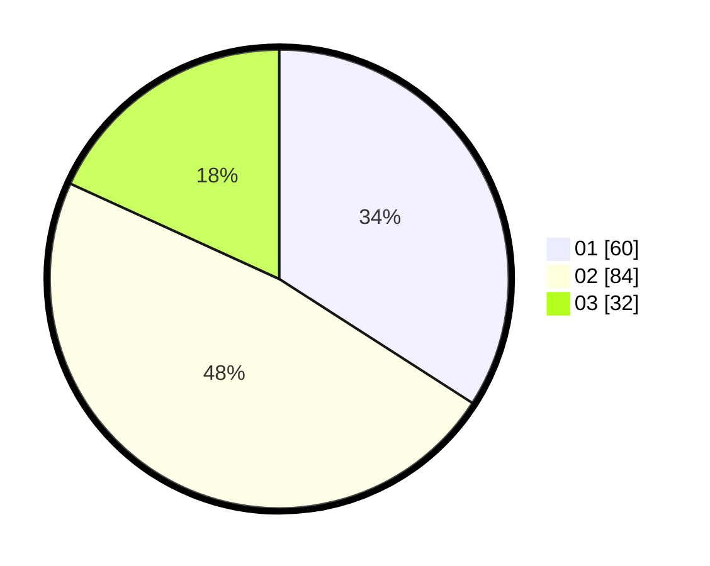

# Hasil

Hasil perolehan suara paslon dapat dilihat pada file paslon-01.txt, paslon-02.txt, dan paslon-03.txt.

Jika tidak ada, artinya data tersebut belum ada pada SIREKAP.

## Perolehan Suara

 * Paslon 01: **60**.
 * Paslon 02: **84**.
 * Paslon 03: **32**.

## Foto C Plano

https://sirekap-obj-formc.kpu.go.id/eb02/pemilu/ppwp/31/71/07/10/05/3171071005075-20240216-012629--e3cfdccb-8fa5-443a-a314-0b0d333c8ef7.jpg

https://sirekap-obj-formc.kpu.go.id/eb02/pemilu/ppwp/31/71/07/10/05/3171071005075-20240216-012631--6d881999-654c-4918-a76d-50b351398879.jpg

https://sirekap-obj-formc.kpu.go.id/eb02/pemilu/ppwp/31/71/07/10/05/3171071005075-20240216-012630--534b85df-0891-4a7f-a004-053eeb03d5ae.jpg

## DATA PEMILIH TETAP

Jumlah pemilih dalam DPT: **274**.
 * L: **150**.
 * P: **124**.

## DATA PENGGUNA HAK PILIH

Jumlah pengguna hak pilih dalam DPT: **177**.
 * L: **94**.
 * P: **83**.

Jumlah pengguna hak pilih dalam DPTb: **0**.
 * L: **0**.
 * P: **0**.

Jumlah pengguna hak pilih dalam DPK: **0**.
 * L: **0**.
 * P: **0**.

Jumlah pengguna hak pilih: **177**.
 * L: **94**.
 * P: **83**.

## JUMLAH SUARA SAH DAN TIDAK SAH

JUMLAH SELURUH SUARA SAH: **176**.

JUMLAH SUARA TIDAK SAH: **1**.

JUMLAH SELURUH SUARA SAH DAN SUARA TIDAK SAH: **177**.
