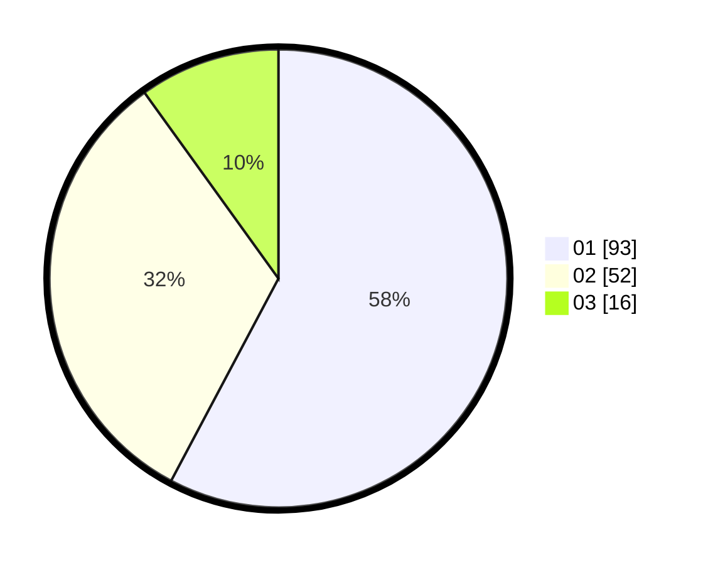

# Hasil

Hasil perolehan suara paslon dapat dilihat pada file paslon-01.txt, paslon-02.txt, dan paslon-03.txt.

Jika tidak ada, artinya data tersebut belum ada pada SIREKAP.

## Perolehan Suara

 * Paslon 01: **93**.
 * Paslon 02: **52**.
 * Paslon 03: **16**.

## Foto C Plano

https://sirekap-obj-formc.kpu.go.id/ccfc/pemilu/ppwp/31/71/07/10/05/3171071005079-20240214-225232--6373f829-06d1-4a3f-95ef-0d1f1af90fc2.jpg

https://sirekap-obj-formc.kpu.go.id/ccfc/pemilu/ppwp/31/71/07/10/05/3171071005079-20240214-225325--4b04ec7d-67da-4cd7-8d48-1d4e6733eb4c.jpg

https://sirekap-obj-formc.kpu.go.id/ccfc/pemilu/ppwp/31/71/07/10/05/3171071005079-20240214-225430--18d8c4e6-cf33-40ce-b154-f5c863a1543b.jpg
