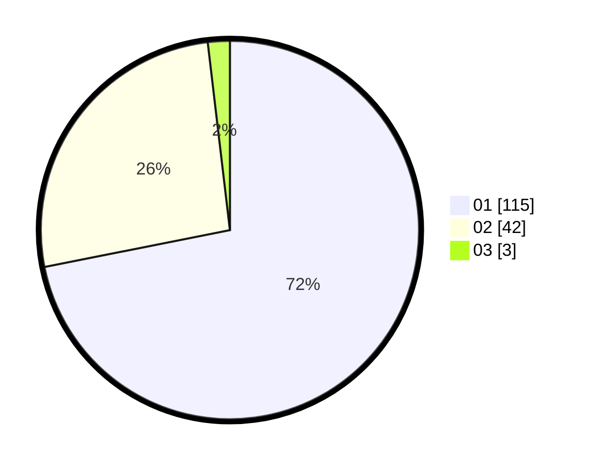

# Hasil

Hasil perolehan suara paslon dapat dilihat pada file paslon-01.txt, paslon-02.txt, dan paslon-03.txt.

Jika tidak ada, artinya data tersebut belum ada pada SIREKAP.

## Perolehan Suara

 * Paslon 01: **115**.
 * Paslon 02: **42**.
 * Paslon 03: **3**.

## Foto C Plano

https://sirekap-obj-formc.kpu.go.id/3a35/pemilu/ppwp/31/71/07/10/05/3171071005083-20240214-194240--8d8ff806-97c8-4070-84f5-4f4faea04bae.jpg

https://sirekap-obj-formc.kpu.go.id/3a35/pemilu/ppwp/31/71/07/10/05/3171071005083-20240214-194445--b3e69220-9997-48ca-97c8-2f3b923a98c4.jpg

https://sirekap-obj-formc.kpu.go.id/3a35/pemilu/ppwp/31/71/07/10/05/3171071005083-20240214-193113--3387efa0-693d-49db-a863-eff2ac6517c9.jpg

## DATA PEMILIH TETAP

Jumlah pemilih dalam DPT: **227**.
 * L: **114**.
 * P: **113**.

## DATA PENGGUNA HAK PILIH

Jumlah pengguna hak pilih dalam DPT: **162**.
 * L: **81**.
 * P: **81**.

Jumlah pengguna hak pilih dalam DPTb: **1**.
 * L: **1**.
 * P: **0**.

Jumlah pengguna hak pilih dalam DPK: **2**.
 * L: **1**.
 * P: **1**.

Jumlah pengguna hak pilih: **165**.
 * L: **83**.
 * P: **82**.

## JUMLAH SUARA SAH DAN TIDAK SAH

JUMLAH SELURUH SUARA SAH: **160**.

JUMLAH SUARA TIDAK SAH: **5**.

JUMLAH SELURUH SUARA SAH DAN SUARA TIDAK SAH: **165**.
