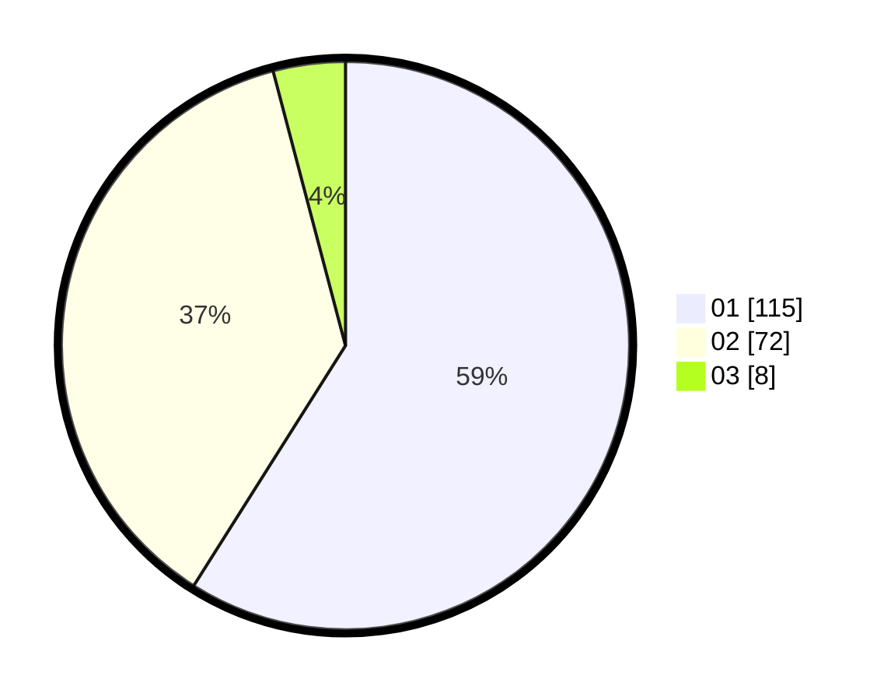

# Hasil

Hasil perolehan suara paslon dapat dilihat pada file paslon-01.txt, paslon-02.txt, dan paslon-03.txt.

Jika tidak ada, artinya data tersebut belum ada pada SIREKAP.

## Perolehan Suara

 * Paslon 01: **115**.
 * Paslon 02: **72**.
 * Paslon 03: **8**.

## Foto C Plano

https://sirekap-obj-formc.kpu.go.id/5091/pemilu/ppwp/31/71/07/10/05/3171071005085-20240215-022046--64d0b50b-0bed-4110-8236-39ebd349f8b3.jpg

https://sirekap-obj-formc.kpu.go.id/5091/pemilu/ppwp/31/71/07/10/05/3171071005085-20240215-022036--7349d2f9-996c-4309-ba9d-878051e49a25.jpg

https://sirekap-obj-formc.kpu.go.id/5091/pemilu/ppwp/31/71/07/10/05/3171071005085-20240215-022055--7d2c6e8e-9dd9-4ee3-9cef-98d03472d6ee.jpg
