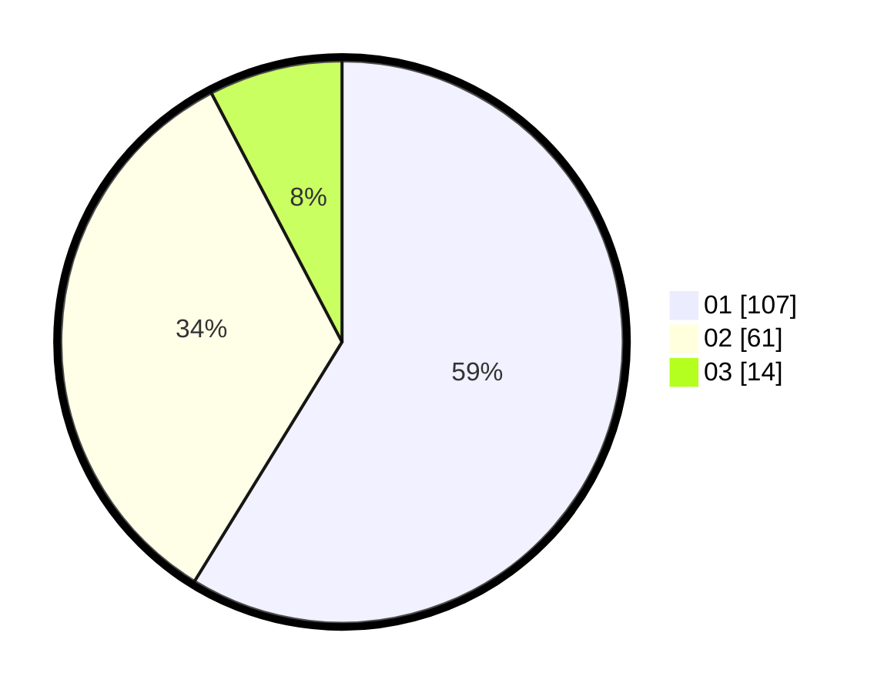

# Hasil

Hasil perolehan suara paslon dapat dilihat pada file paslon-01.txt, paslon-02.txt, dan paslon-03.txt.

Jika tidak ada, artinya data tersebut belum ada pada SIREKAP.

## Perolehan Suara

 * Paslon 01: **107**.
 * Paslon 02: **61**.
 * Paslon 03: **14**.

## Foto C Plano

https://sirekap-obj-formc.kpu.go.id/6bb3/pemilu/ppwp/31/71/07/10/05/3171071005087-20240215-023334--b1d4be58-b1ec-4224-b4ef-81b87b1af2b6.jpg

https://sirekap-obj-formc.kpu.go.id/6bb3/pemilu/ppwp/31/71/07/10/05/3171071005087-20240215-023442--11ea3597-6d03-4f11-bdbc-06a543e03986.jpg

https://sirekap-obj-formc.kpu.go.id/6bb3/pemilu/ppwp/31/71/07/10/05/3171071005087-20240215-023510--2d40117e-29a7-4b82-ae15-503153698cf9.jpg
