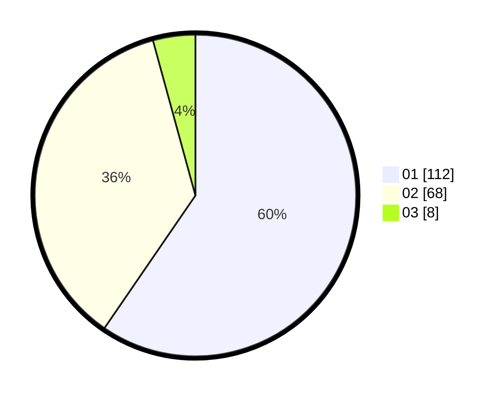

# Hasil

Hasil perolehan suara paslon dapat dilihat pada file paslon-01.txt, paslon-02.txt, dan paslon-03.txt.

Jika tidak ada, artinya data tersebut belum ada pada SIREKAP.

## Perolehan Suara

 * Paslon 01: **112**.
 * Paslon 02: **68**.
 * Paslon 03: **8**.

## Foto C Plano

https://sirekap-obj-formc.kpu.go.id/4996/pemilu/ppwp/31/71/07/10/05/3171071005088-20240214-220247--2d8655d0-7bb3-40cf-8de8-e2e14a204d2a.jpg

https://sirekap-obj-formc.kpu.go.id/4996/pemilu/ppwp/31/71/07/10/05/3171071005088-20240214-220441--069e413e-bab2-44b7-974e-401916dac749.jpg

https://sirekap-obj-formc.kpu.go.id/4996/pemilu/ppwp/31/71/07/10/05/3171071005088-20240214-220722--f002df6c-3193-4c8e-9024-9ece2642a42c.jpg
