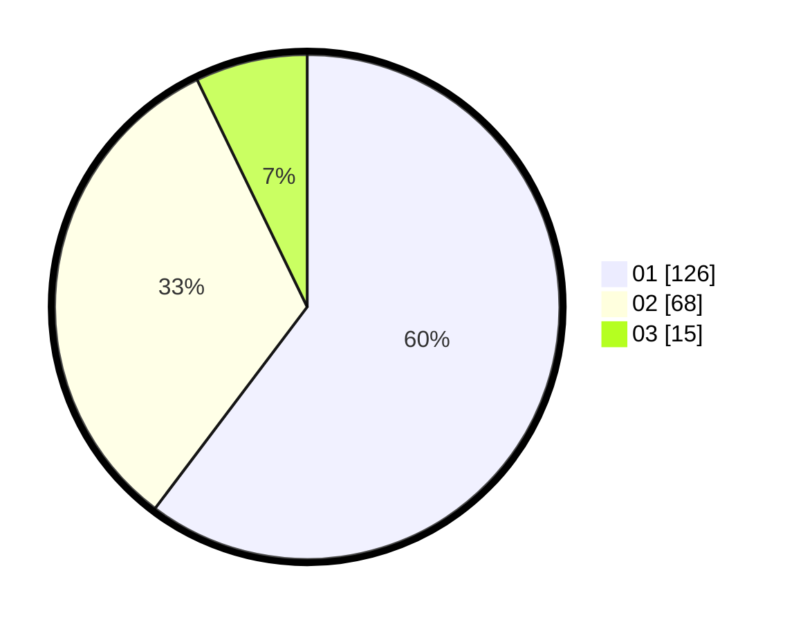

# Hasil

Hasil perolehan suara paslon dapat dilihat pada file paslon-01.txt, paslon-02.txt, dan paslon-03.txt.

Jika tidak ada, artinya data tersebut belum ada pada SIREKAP.

## Perolehan Suara

 * Paslon 01: **126**.
 * Paslon 02: **68**.
 * Paslon 03: **15**.

## Foto C Plano

https://sirekap-obj-formc.kpu.go.id/fa11/pemilu/ppwp/31/71/07/10/05/3171071005089-20240215-125005--8e410859-a344-4fe3-b7bd-f84f6bb75032.jpg

https://sirekap-obj-formc.kpu.go.id/fa11/pemilu/ppwp/31/71/07/10/05/3171071005089-20240215-200512--737aa897-c4f1-402e-9aa2-01c9f401072f.jpg

https://sirekap-obj-formc.kpu.go.id/fa11/pemilu/ppwp/31/71/07/10/05/3171071005089-20240215-125223--81c8b063-9c48-4994-9bca-3e70d24857ae.jpg

## DATA PEMILIH TETAP

Jumlah pemilih dalam DPT: **276**.
 * L: **152**.
 * P: **124**.

## DATA PENGGUNA HAK PILIH

Jumlah pengguna hak pilih dalam DPT: **201**.
 * L: **112**.
 * P: **89**.

Jumlah pengguna hak pilih dalam DPTb: **0**.
 * L: **0**.
 * P: **0**.

Jumlah pengguna hak pilih dalam DPK: **15**.
 * L: **10**.
 * P: **5**.

Jumlah pengguna hak pilih: **216**.
 * L: **122**.
 * P: **94**.

## JUMLAH SUARA SAH DAN TIDAK SAH

JUMLAH SELURUH SUARA SAH: **209**.

JUMLAH SUARA TIDAK SAH: **7**.

JUMLAH SELURUH SUARA SAH DAN SUARA TIDAK SAH: **216**.
