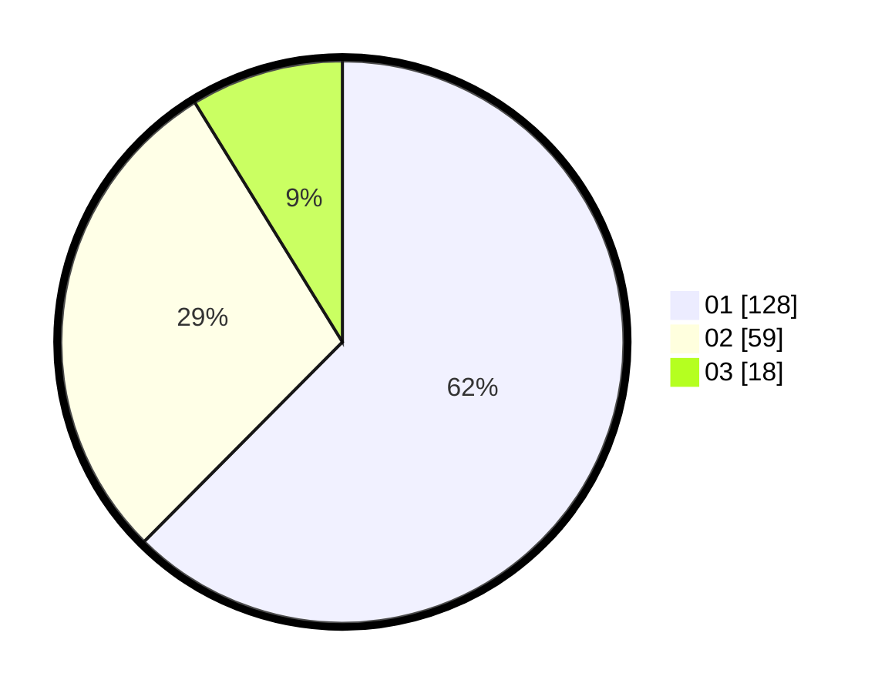

# Hasil

Hasil perolehan suara paslon dapat dilihat pada file paslon-01.txt, paslon-02.txt, dan paslon-03.txt.

Jika tidak ada, artinya data tersebut belum ada pada SIREKAP.

## Perolehan Suara

 * Paslon 01: **128**.
 * Paslon 02: **59**.
 * Paslon 03: **18**.

## Foto C Plano

https://sirekap-obj-formc.kpu.go.id/85bd/pemilu/ppwp/31/71/07/10/05/3171071005090-20240215-021317--c03df443-7fde-4fb0-a56f-c6d3bdeeea3b.jpg

https://sirekap-obj-formc.kpu.go.id/85bd/pemilu/ppwp/31/71/07/10/05/3171071005090-20240215-021459--dc4b2f7a-f3d9-42de-8c0c-a92c21d3759e.jpg

https://sirekap-obj-formc.kpu.go.id/85bd/pemilu/ppwp/31/71/07/10/05/3171071005090-20240215-021629--ef4272b1-6b47-4efb-8cdd-fbcc64d55608.jpg

## DATA PEMILIH TETAP

Jumlah pemilih dalam DPT: **263**.
 * L: **137**.
 * P: **126**.

## DATA PENGGUNA HAK PILIH

Jumlah pengguna hak pilih dalam DPT: **207**.
 * L: **103**.
 * P: **104**.

Jumlah pengguna hak pilih dalam DPTb: **0**.
 * L: **0**.
 * P: **0**.

Jumlah pengguna hak pilih dalam DPK: **3**.
 * L: **1**.
 * P: **2**.

Jumlah pengguna hak pilih: **210**.
 * L: **104**.
 * P: **106**.

## JUMLAH SUARA SAH DAN TIDAK SAH

JUMLAH SELURUH SUARA SAH: **205**.

JUMLAH SUARA TIDAK SAH: **5**.

JUMLAH SELURUH SUARA SAH DAN SUARA TIDAK SAH: **210**.
