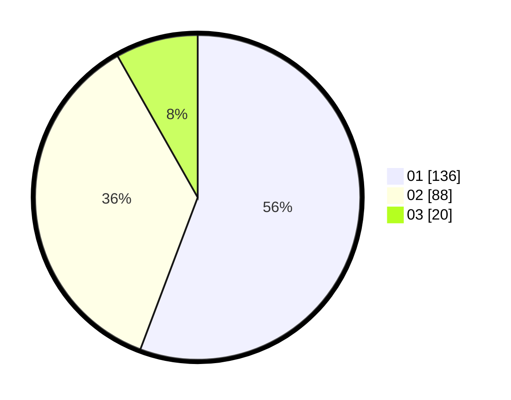

# Hasil

Hasil perolehan suara paslon dapat dilihat pada file paslon-01.txt, paslon-02.txt, dan paslon-03.txt.

Jika tidak ada, artinya data tersebut belum ada pada SIREKAP.

## Perolehan Suara

 * Paslon 01: **136**.
 * Paslon 02: **88**.
 * Paslon 03: **20**.

## Foto C Plano

https://sirekap-obj-formc.kpu.go.id/c400/pemilu/ppwp/31/71/07/10/05/3171071005094-20240214-221707--d5342685-f1a9-408c-a5b9-40c634c5ef7e.jpg

https://sirekap-obj-formc.kpu.go.id/c400/pemilu/ppwp/31/71/07/10/05/3171071005094-20240214-221515--66a83829-452b-471d-b2b9-9f96966b49f7.jpg

https://sirekap-obj-formc.kpu.go.id/c400/pemilu/ppwp/31/71/07/10/05/3171071005094-20240214-221338--664034fa-ba9a-4a28-8508-b610d03d3b7a.jpg
