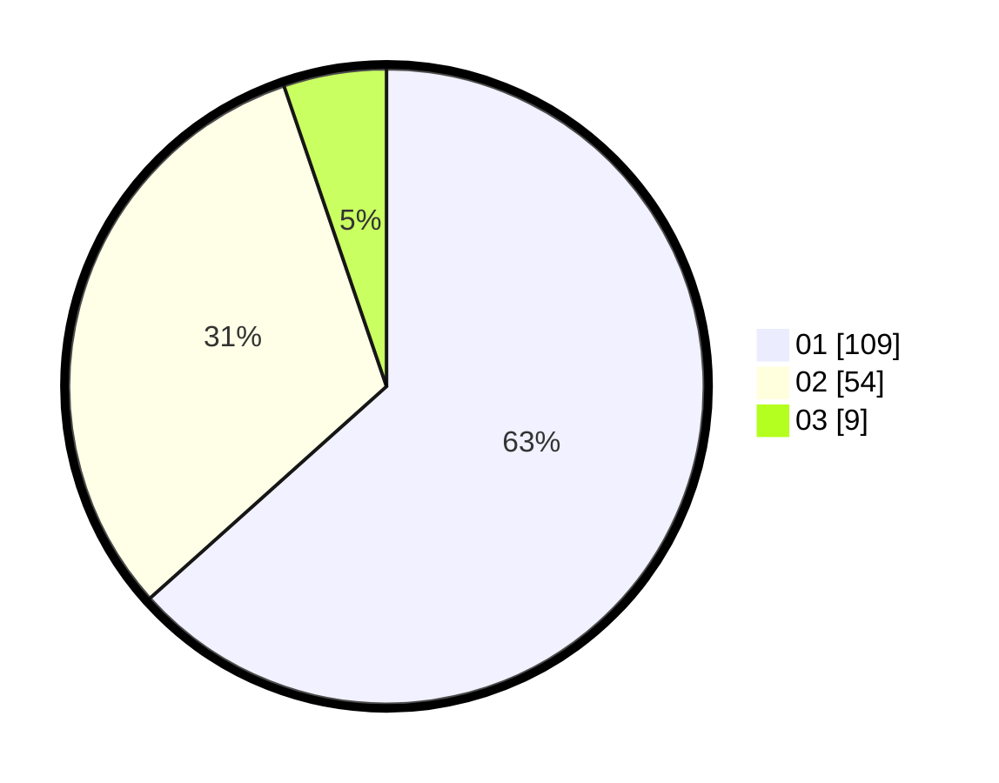

# Hasil

Hasil perolehan suara paslon dapat dilihat pada file paslon-01.txt, paslon-02.txt, dan paslon-03.txt.

Jika tidak ada, artinya data tersebut belum ada pada SIREKAP.

## Perolehan Suara

 * Paslon 01: **109**.
 * Paslon 02: **54**.
 * Paslon 03: **9**.

## Foto C Plano

https://sirekap-obj-formc.kpu.go.id/e535/pemilu/ppwp/31/71/07/10/05/3171071005095-20240215-004120--fbb9df95-2c81-4a3d-a617-11422e4ad6ca.jpg

https://sirekap-obj-formc.kpu.go.id/e535/pemilu/ppwp/31/71/07/10/05/3171071005095-20240215-021903--f88651a8-bac2-49b0-b65d-b1c9f1070386.jpg

https://sirekap-obj-formc.kpu.go.id/e535/pemilu/ppwp/31/71/07/10/05/3171071005095-20240215-004327--ac648bcf-af35-41df-baa6-13a3cc76227c.jpg
