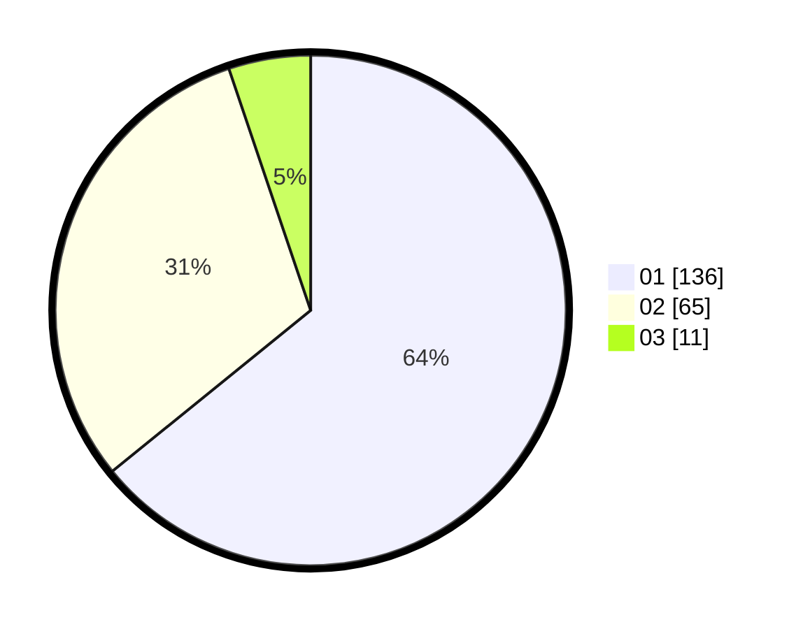

# Hasil

Hasil perolehan suara paslon dapat dilihat pada file paslon-01.txt, paslon-02.txt, dan paslon-03.txt.

Jika tidak ada, artinya data tersebut belum ada pada SIREKAP.

## Perolehan Suara

 * Paslon 01: **136**.
 * Paslon 02: **65**.
 * Paslon 03: **11**.

## Foto C Plano

https://sirekap-obj-formc.kpu.go.id/b4bc/pemilu/ppwp/31/71/07/10/05/3171071005103-20240214-223046--751e1348-e1ae-4989-9b8f-1a5c44860e46.jpg

https://sirekap-obj-formc.kpu.go.id/b4bc/pemilu/ppwp/31/71/07/10/05/3171071005103-20240214-223312--6ebb0995-4020-48df-aa60-466cb355f147.jpg
