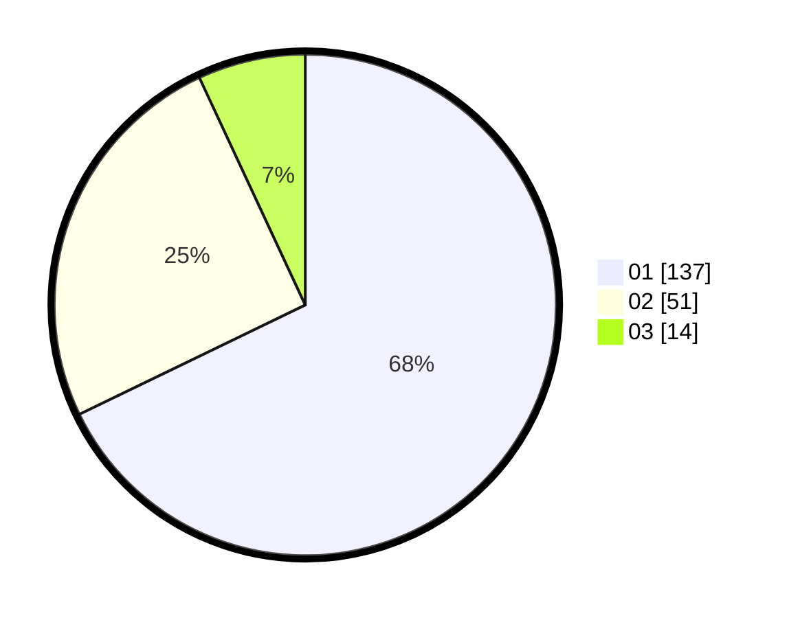

# Hasil

Hasil perolehan suara paslon dapat dilihat pada file paslon-01.txt, paslon-02.txt, dan paslon-03.txt.

Jika tidak ada, artinya data tersebut belum ada pada SIREKAP.

## Perolehan Suara

 * Paslon 01: **137**.
 * Paslon 02: **51**.
 * Paslon 03: **14**.

## Foto C Plano

https://sirekap-obj-formc.kpu.go.id/855f/pemilu/ppwp/31/71/07/10/05/3171071005108-20240214-211242--0e69ce06-4dee-4d05-86cb-3aec0b9cb81d.jpg

https://sirekap-obj-formc.kpu.go.id/855f/pemilu/ppwp/31/71/07/10/05/3171071005108-20240214-223717--1b919779-0918-4f77-a992-4e5ed53c279e.jpg

https://sirekap-obj-formc.kpu.go.id/855f/pemilu/ppwp/31/71/07/10/05/3171071005108-20240214-211504--705e7aa5-6ecc-43b6-94a7-7c13f8b42eed.jpg

## DATA PEMILIH TETAP

Jumlah pemilih dalam DPT: **266**.
 * L: **134**.
 * P: **132**.

## DATA PENGGUNA HAK PILIH

Jumlah pengguna hak pilih dalam DPT: **203**.
 * L: **97**.
 * P: **106**.

Jumlah pengguna hak pilih dalam DPTb: **3**.
 * L: **1**.
 * P: **2**.

Jumlah pengguna hak pilih dalam DPK: **0**.
 * L: **0**.
 * P: **0**.

Jumlah pengguna hak pilih: **206**.
 * L: **98**.
 * P: **108**.

## JUMLAH SUARA SAH DAN TIDAK SAH

JUMLAH SELURUH SUARA SAH: **202**.

JUMLAH SUARA TIDAK SAH: **4**.

JUMLAH SELURUH SUARA SAH DAN SUARA TIDAK SAH: **206**.
