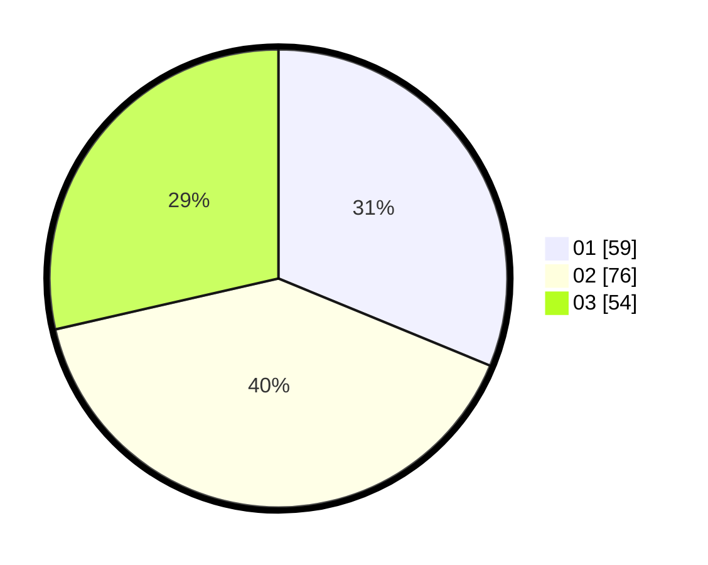

# Hasil

Hasil perolehan suara paslon dapat dilihat pada file paslon-01.txt, paslon-02.txt, dan paslon-03.txt.

Jika tidak ada, artinya data tersebut belum ada pada SIREKAP.

## Perolehan Suara

 * Paslon 01: **59**.
 * Paslon 02: **76**.
 * Paslon 03: **54**.

## Foto C Plano

https://sirekap-obj-formc.kpu.go.id/271b/pemilu/ppwp/31/71/07/10/06/3171071006001-20240214-231649--2e4fc7a2-0c72-49e4-8b84-3f9d86b94463.jpg

https://sirekap-obj-formc.kpu.go.id/271b/pemilu/ppwp/31/71/07/10/06/3171071006001-20240214-211814--1b69dab0-579b-4682-a0b4-447616a4e8ea.jpg
