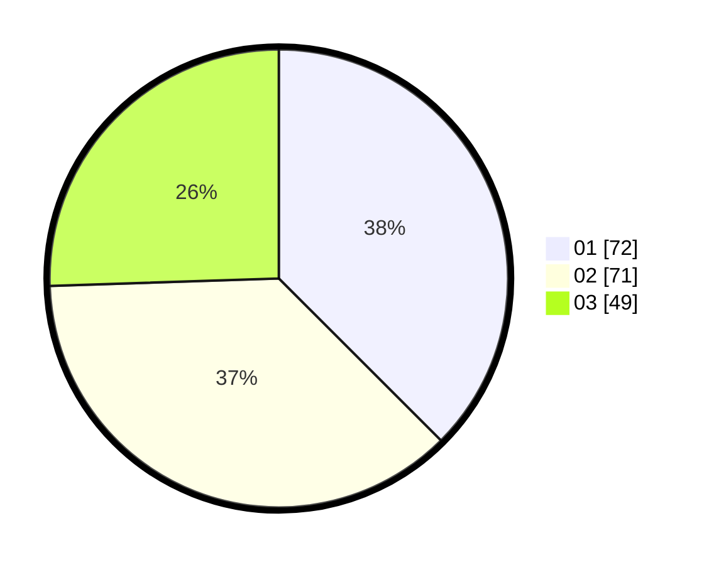

# Hasil

Hasil perolehan suara paslon dapat dilihat pada file paslon-01.txt, paslon-02.txt, dan paslon-03.txt.

Jika tidak ada, artinya data tersebut belum ada pada SIREKAP.

## Perolehan Suara

 * Paslon 01: **72**.
 * Paslon 02: **71**.
 * Paslon 03: **49**.

## Foto C Plano

https://sirekap-obj-formc.kpu.go.id/8c2d/pemilu/ppwp/31/71/07/10/06/3171071006003-20240217-185932--6e17ed4f-e2e4-4d5f-acaa-0b7978aa49e8.jpg

https://sirekap-obj-formc.kpu.go.id/8c2d/pemilu/ppwp/31/71/07/10/06/3171071006003-20240217-190343--e9459f20-ff8b-45fc-94a1-e0be378102b5.jpg

https://sirekap-obj-formc.kpu.go.id/8c2d/pemilu/ppwp/31/71/07/10/06/3171071006003-20240217-190215--a50ba664-ad54-4eae-ab52-cdf8dcacbcac.jpg
