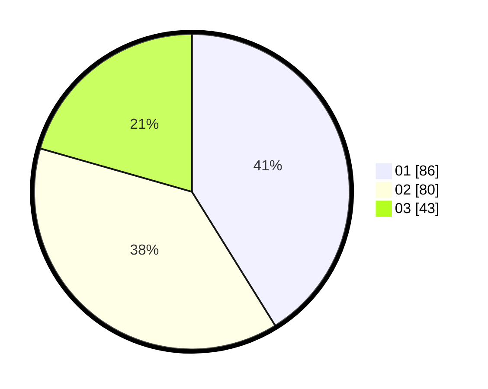

# Hasil

Hasil perolehan suara paslon dapat dilihat pada file paslon-01.txt, paslon-02.txt, dan paslon-03.txt.

Jika tidak ada, artinya data tersebut belum ada pada SIREKAP.

## Perolehan Suara

 * Paslon 01: **86**.
 * Paslon 02: **80**.
 * Paslon 03: **43**.

## Foto C Plano

https://sirekap-obj-formc.kpu.go.id/a61a/pemilu/ppwp/31/71/07/10/06/3171071006004-20240215-024047--29d9737c-80b9-4959-8fe7-7d1c4a032eae.jpg

https://sirekap-obj-formc.kpu.go.id/a61a/pemilu/ppwp/31/71/07/10/06/3171071006004-20240215-024255--688481d7-1c60-4e48-8d8b-50a9409c1ecc.jpg

https://sirekap-obj-formc.kpu.go.id/a61a/pemilu/ppwp/31/71/07/10/06/3171071006004-20240215-024533--879614e0-0576-4d46-a212-671af6bc4522.jpg

## DATA PEMILIH TETAP

Jumlah pemilih dalam DPT: **267**.
 * L: **130**.
 * P: **137**.

## DATA PENGGUNA HAK PILIH

Jumlah pengguna hak pilih dalam DPT: **206**.
 * L: **91**.
 * P: **115**.

Jumlah pengguna hak pilih dalam DPTb: **1**.
 * L: **1**.
 * P: **0**.

Jumlah pengguna hak pilih dalam DPK: **4**.
 * L: **3**.
 * P: **1**.

Jumlah pengguna hak pilih: **211**.
 * L: **95**.
 * P: **166**.

## JUMLAH SUARA SAH DAN TIDAK SAH

JUMLAH SELURUH SUARA SAH: **209**.

JUMLAH SUARA TIDAK SAH: **2**.

JUMLAH SELURUH SUARA SAH DAN SUARA TIDAK SAH: **211**.
