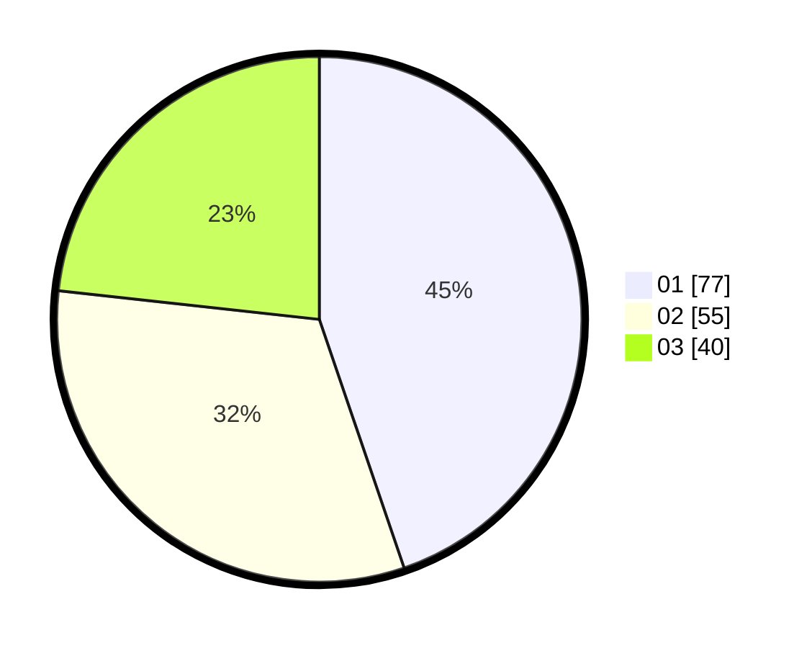

# Hasil

Hasil perolehan suara paslon dapat dilihat pada file paslon-01.txt, paslon-02.txt, dan paslon-03.txt.

Jika tidak ada, artinya data tersebut belum ada pada SIREKAP.

## Perolehan Suara

 * Paslon 01: **77**.
 * Paslon 02: **55**.
 * Paslon 03: **40**.

## Foto C Plano

https://sirekap-obj-formc.kpu.go.id/904f/pemilu/ppwp/31/71/07/10/06/3171071006005-20240216-221527--8643432d-a876-4b7e-a21d-281a291081fc.jpg

https://sirekap-obj-formc.kpu.go.id/904f/pemilu/ppwp/31/71/07/10/06/3171071006005-20240216-221528--8f2f5c1c-6028-4743-9ab5-7d57a4db4b4b.jpg

https://sirekap-obj-formc.kpu.go.id/904f/pemilu/ppwp/31/71/07/10/06/3171071006005-20240216-221528--656fcab8-69d7-4ce5-a915-68a30480f98d.jpg

## DATA PEMILIH TETAP

Jumlah pemilih dalam DPT: **231**.
 * L: **102**.
 * P: **129**.

## DATA PENGGUNA HAK PILIH

Jumlah pengguna hak pilih dalam DPT: **169**.
 * L: **73**.
 * P: **96**.

Jumlah pengguna hak pilih dalam DPTb: **4**.
 * L: **1**.
 * P: **3**.

Jumlah pengguna hak pilih dalam DPK: **1**.
 * L: **1**.
 * P: **0**.

Jumlah pengguna hak pilih: **174**.
 * L: **75**.
 * P: **99**.

## JUMLAH SUARA SAH DAN TIDAK SAH

JUMLAH SELURUH SUARA SAH: **172**.

JUMLAH SUARA TIDAK SAH: **2**.

JUMLAH SELURUH SUARA SAH DAN SUARA TIDAK SAH: **174**.
