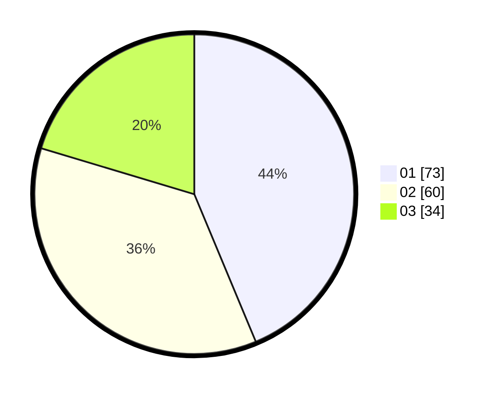

# Hasil

Hasil perolehan suara paslon dapat dilihat pada file paslon-01.txt, paslon-02.txt, dan paslon-03.txt.

Jika tidak ada, artinya data tersebut belum ada pada SIREKAP.

## Perolehan Suara

 * Paslon 01: **73**.
 * Paslon 02: **60**.
 * Paslon 03: **34**.

## Foto C Plano

https://sirekap-obj-formc.kpu.go.id/548d/pemilu/ppwp/31/71/07/10/06/3171071006006-20240214-231454--40d6a195-c492-46b9-8edf-70bbe37121f7.jpg

https://sirekap-obj-formc.kpu.go.id/548d/pemilu/ppwp/31/71/07/10/06/3171071006006-20240214-231534--80059b75-96d5-4970-8fc7-a7df43b1b45e.jpg

https://sirekap-obj-formc.kpu.go.id/548d/pemilu/ppwp/31/71/07/10/06/3171071006006-20240214-231545--e6732063-2735-4c65-a868-e77453ca420a.jpg
